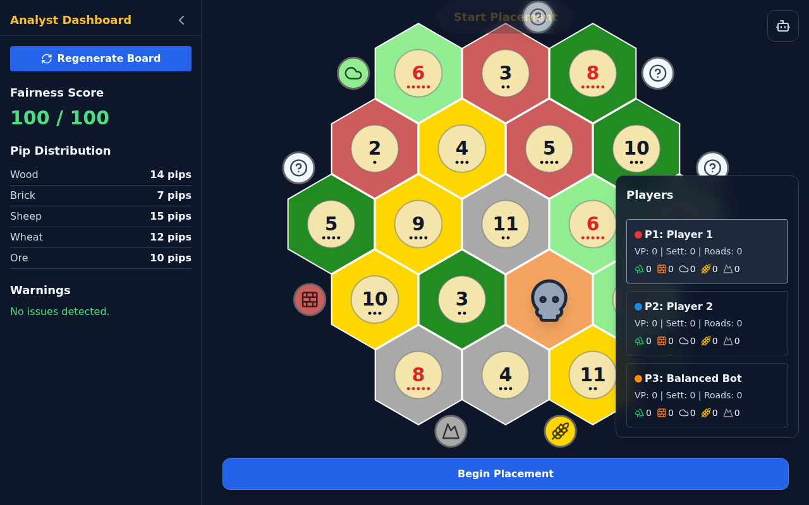
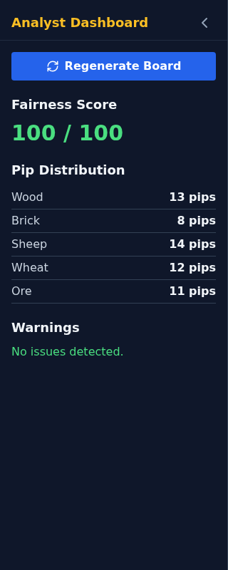
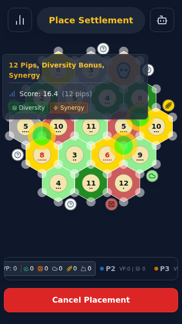
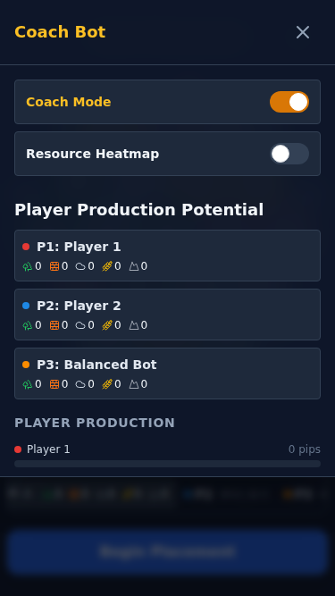

# Hex-Mastery

### The Ultimate Catan Strategy Engine & Coach

**Hex-Mastery** is a modern, web-based implementation of the classic trading game, built specifically to help you master the math, probability, and strategy behind the board.

## 🏆 Why Hex-Mastery?

Most Catan clones are just games. **Hex-Mastery is a trainer.**

We realized that to truly improve, players need immediate, data-driven feedback on their decisions. Hex-Mastery integrates a real-time **Coach** that analyzes the board state using advanced heuristics—evaluating scarcity, pip distribution, and production synergy—to grade your moves as you make them.

## ✨ Key Features

### 🧠 The Coach Mode
Don't just guess—know. The Coach analyzes every valid settlement spot on the board and visualizes the "Winning Moves" using a dynamic heatmap. It factors in:
*   **Production Probability (Pips)**
*   **Resource Scarcity** (Is Ore rare this game?)
*   **Synergy** (Do you have the Brick to match your Wood?)

### 📊 The Analyst Dashboard
A real-time sidebar that acts as your HUD.
*   **Fairness Meter**: See if the random board generation favored one player.
*   **Player Production Potential**: Compare your resource-generating power against your opponents at a glance.
*   **Resource Heatmaps**: Instantly spot the "Ore Droughts" or "Wheat Gluts."

### 🐍 The Setup Trainer
Practice the most critical phase of the game: The Snake Draft.
*   Play against our **Smart Bots** to test your initial placement strategies.
*   Experiment with being Player 1 (Best Spot) vs. Player 4 (The Wheel).

### 📱 Mobile First Design
Play and train anywhere. The interface is fully responsive, and the advanced Coach features are available on any device. Even on mobile, you get the same "golden ring" suggestions for top-tier moves. On devices with a stylus or mouse, you can even access the "Why?" tooltips to understand the Coach's reasoning.

The Analyst Panel is also fully accessible, tucking away into a clean bottom drawer to maximize board visibility.

## 📚 Documentation

Whether you are a player looking to improve your win rate or a developer looking to contribute, we have you covered.

*   **[Strategy Engine Deep Dive](./docs/STRATEGY_ENGINE.md)**
    *Learn the math behind the game. Understanding Pips, the Bell Curve, and how the Coach calculates the "Perfect Move."*

*   **[Development Guide](./docs/DEVELOPMENT.md)**
    *For developers. Installation instructions, tech stack (React + boardgame.io), and contribution guidelines.*

## 🚀 Getting Started

1.  **Select a Mode**: Choose "Single Player (vs AI)" to practice or "Pass & Play" for local games.
2.  **Toggle Coach Mode**: Switch on the Analyst Dashboard to see the math behind the board.
3.  **Master the Setup**: Use the recommendations to learn *why* certain spots are better than others.

---
*Built with React, TypeScript, and boardgame.io. Open Source and designed for the community.*
