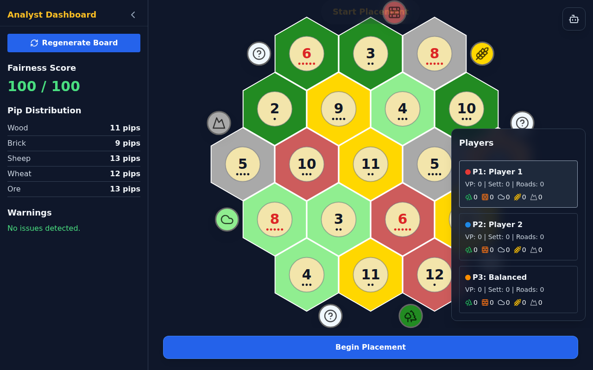
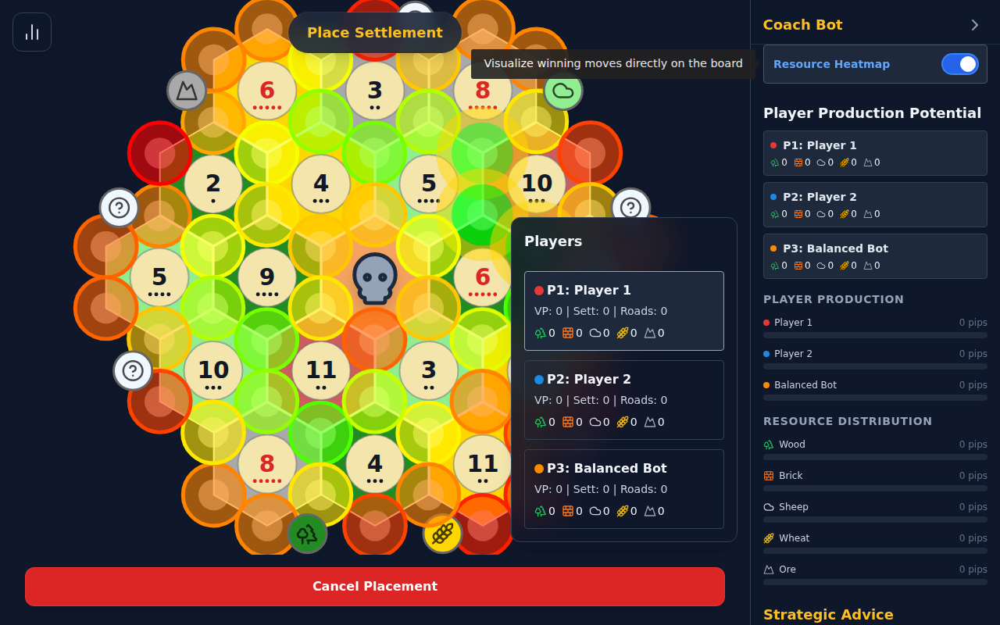
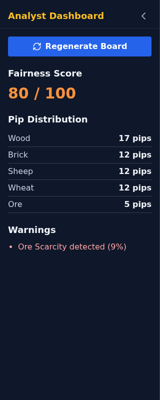
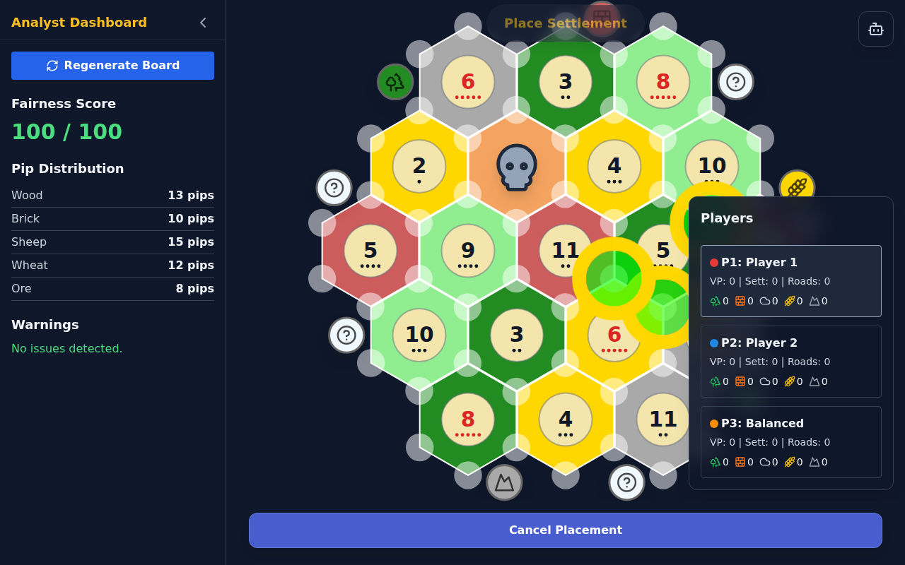
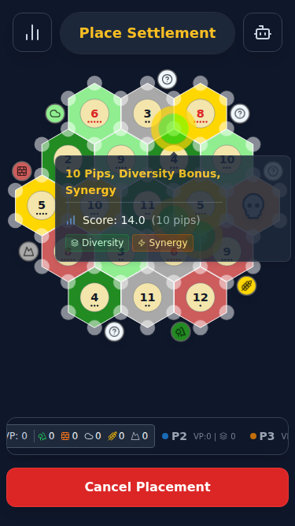
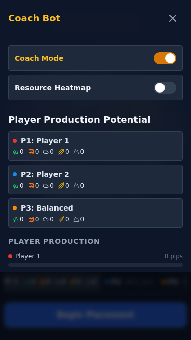

# Hex-Mastery

**Live App:** [**https://g1ddy.github.io/catan-hex-mastery/**](https://g1ddy.github.io/catan-hex-mastery/)

---

### The Ultimate Catan Strategy Engine & Coach

**Hex-Mastery** is a modern, web-based implementation of the classic trading game, built specifically to help you master the math, probability, and strategy behind the board.

## 🏆 Why Hex-Mastery?

Most Catan clones are just games. **Hex-Mastery is a trainer.**

To truly improve, players need immediate, data-driven feedback on their decisions. Hex-Mastery integrates a real-time **Coach** that analyzes the board state using advanced heuristics—evaluating scarcity, pip distribution, and production synergy—to grade your moves as you make them.

## ✨ Key Features

### 🧠 Coach Mode
Don't just guess—know. The Coach analyzes every valid settlement spot on the board and visualizes top choices using a dynamic heatmap.

**Key Features:**
*   **Resource Heatmap**: See winning moves directly on the board with a color-coded overlay.
*   **Player Production Potential**: Compare your resource-generating power against your opponents at a glance.

**Heatmap Factors:**
The Coach evaluates moves based on:
*   **Production Probability (Pips)**
*   **Synergy** (Do you have the Brick to match your Wood?)
*   **Scarcity** (Are you securing rare resources?)

### 📊 The Analyst Dashboard
A real-time sidebar that acts as your HUD.
*   **Fairness Meter**: See if the random board generation favored one player.
*   **Pip Distribution**: Analyze the abundance of each resource type on the board.
*   **Scarcity Warnings**: Instantly spot "Ore Droughts" or "Wheat Gluts" before they happen.

### 🐍 The Setup Trainer
Practice the most critical phase of the game: The Snake Draft.
*   **Play against Smart Bots**: Test your strategies against AI opponents.
*   **Optimized for 3 Players**: Designed for balanced 3-player matches.
*   **Flexible Configurations**:
    *   **Solo**: 1 Human + 2 Bots
    *   **Local Multiplayer**: 2 Humans + 1 Bot
    *   **Local PvP**: 3 Humans
    *   **Auto Play**: 0 Humans + 3 Bots (Spectate mode)

### 📱 Mobile-First Design
Play and train anywhere. The interface is fully responsive, and advanced Coach features are available on any device. Even on mobile, you get the same golden ring suggestions for top-tier moves and bottom drawers for board visibility.

## 🚀 Getting Started

1. **Launch the App**: Open the [live app](https://g1ddy.github.io/catan-hex-mastery/) or run `npm run dev` locally.
2. **Select a Mode**: Choose "Single Player (vs AI)" to practice or "Pass & Play" for local games.
3. **Enable Coach Mode**: Turn on the assistant and use the **Resource Heatmap** to visualize winning moves.
4. **Master the Setup**: Use recommendations to learn *why* certain spots offer better long-term potential.

## 📚 Documentation Index

For detailed guidelines, contracts, and technical specifications, refer to the authoritative documents:

*   **[Development Guide](./docs/DEVELOPMENT.md)** — Prerequisites, local setup, canonical commands, verification standards, generated evidence workflows, and documentation ownership.
*   **[Architecture Guide](./docs/ARCHITECTURE.md)** — Layered architecture (Layers -1 to 3), responsibility boundaries, dependency rules, and conceptual vs. generated structure.
*   **[Roadmap](./docs/ROADMAP.md)** — The single source for unfinished product, engine, architecture, and maintenance work plus intentional deferrals.
*   **[Complexity & Code Health](./docs/COMPLEXITY.md)** — Metric definitions, warning thresholds, canonical `.maritime/` evidence profile, and interpretation rules.
*   **[Strategy Engine Deep Dive](./docs/STRATEGY_ENGINE.md)** — Hex-Mastery's implementation-facing strategy model, probability calculations, and Coach/Analyst behavior rules.

---
*Built with React, TypeScript, and boardgame.io. Open Source and designed for the community.*
