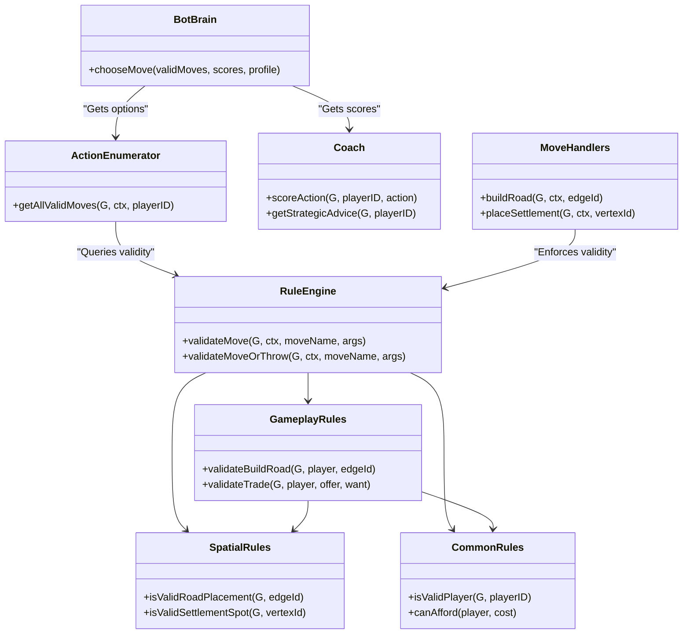
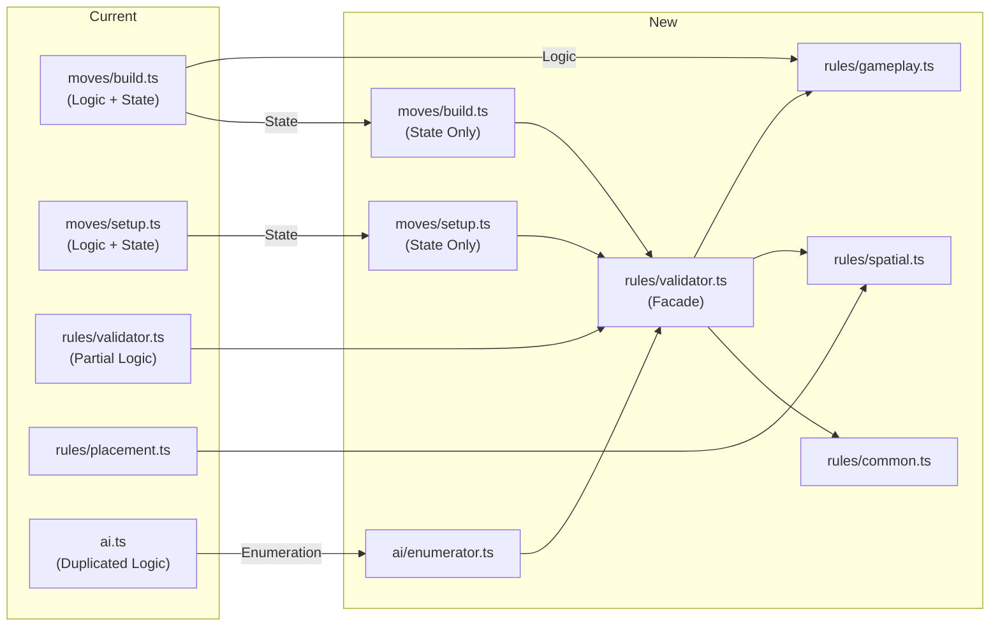

# Refactoring Plan: Unified Move Architecture

## 1. Architecture Overview

### Target Architecture (4-Layer Design)

This architecture strictly separates concerns into Rules (Validation), Enumeration (Listing), Evaluation (Scoring), and Decision (Acting).

### Transition Diagram (Current -> New)

---

## 2. Class Descriptions

### `src/game/rules/validator.ts` (The Rule Engine)
*   **Purpose:** The single entry point for all validation. Hides the complexity of specific rule modules.
*   **Sample Methods:**
    *   `validateMove(G, ctx, moveName, args): ValidationResult`
    *   `validateMoveOrThrow(...)`: Helper for Move handlers.
*   **Interactions:** Called by `ActionEnumerator` (to find valid moves) and `MoveHandlers` (to enforce rules). Delegates to `GameplayRules`, `SpatialRules`, etc.

### `src/game/rules/gameplay.ts`
*   **Purpose:** Validates state-dependent gameplay actions (Acting Phase).
*   **Sample Methods:**
    *   `validateBuildRoad(G, player, edgeId)`: Checks cost + connectivity.
    *   `validateBuildCity(G, player, vertexId)`: Checks cost + ownership + type.
*   **Interactions:** Uses `CommonRules` for costs and `SpatialRules` for geometry.

### `src/game/rules/spatial.ts` (Refactored `placement.ts`)
*   **Purpose:** Pure geometric validation (mostly for Setup and base connectivity).
*   **Sample Methods:** `isValidSettlementPlacement`, `hasRoadConnection`.
*   **Interactions:** Pure logic, rarely dependencies.

### `src/game/rules/common.ts`
*   **Purpose:** Shared utilities for security and resource management.
*   **Sample Methods:** `isValidPlayer`, `canAfford`.

### `src/game/ai/enumerator.ts` (Refactored `ai.ts`)
*   **Purpose:** Generates concrete `GameAction` objects for a turn.
*   **Sample Methods:** `enumerate(G, ctx, playerID): GameAction[]`
*   **Interactions:** Iterates through `STAGE_MOVES`, generates candidates (e.g., all edges), and filters them using `RuleEngine`.

---

## 3. Refactoring Plan (Phases)

### Phase 1: Modularize Rules & Centralize Gameplay Logic
*   **Priority:** High (Fixes duplication in `build.ts` and `validator.ts`)
*   **Goal:** Create the modular rule structure and strip validation logic from `moves/build.ts`.
*   **Steps:**
    1.  Create `src/game/rules/common.ts` (Extract `isValidPlayer` and cost checks).
    2.  Rename `rules/placement.ts` to `rules/spatial.ts` (or alias it).
    3.  Create `src/game/rules/gameplay.ts` and move logic from `moves/build.ts` into it.
    4.  Update `rules/validator.ts` to export the Facade API (`validateMove`).
    5.  Update `moves/build.ts` to use `RuleEngine.validateMoveOrThrow`.
*   **Definition of Done:** `moves/build.ts` contains NO logic (only state updates). Unit tests pass.
*   **Regression Testing:** Run `npm test`. Focus on `build.ts` tests; they should pass without modification (or minor error message updates).

### Phase 2: Standardize Setup & Facade API
*   **Priority:** Medium (Prepares for AI Refactor)
*   **Goal:** Ensure `setup.ts` and all other moves use the same Facade.
*   **Steps:**
    1.  Update `rules/validator.ts` to fully handle Setup moves via delegation to `spatial.ts`.
    2.  Refactor `moves/setup.ts` to use `RuleEngine.validateMoveOrThrow`.
    3.  Ensure `validator.ts` exposes `getValidMovesForStage` (used by UI) using the new internal modules.
*   **Definition of Done:** All `src/game/moves/*.ts` files rely solely on `RuleEngine`.
*   **Regression Testing:** Run `npm test`. Verify Setup phase in E2E tests (`npm run test:e2e`).

### Phase 3: The AI Enumerator (Delete `ai.ts` Logic)
*   **Priority:** High (Removes massive duplication)
*   **Goal:** Delete the switch-case logic in `ai.ts`.
*   **Steps:**
    1.  Refactor `ai.ts` to become `ActionEnumerator`.
    2.  Implement a loop that reads `STAGE_MOVES` (from constants).
    3.  For each move type, query `RuleEngine` to find valid arguments (e.g., "Which edges are valid for `buildRoad`?").
    4.  Remove manual checks in `ai.ts`.
*   **Definition of Done:** `ai.ts` is generic and data-driven. Adding a new move to `constants.ts` automatically makes it available to the AI.
*   **Regression Testing:** `npm test` (specifically `ai.test.ts`). Verify Bots still play correctly in `npm run test:e2e`.

### Phase 4: Bot & Coach Integration
*   **Priority:** Medium (Feature Request / Clean up)
*   **Goal:** Unify "Strategic Advice" and "Bot Decisions".
*   **Steps:**
    1.  Update `Coach` to score generic Actions.
    2.  Update `BotCoach` to use `Coach.scoreAction`.
*   **Definition of Done:** Bots dynamically react to strategy changes.
