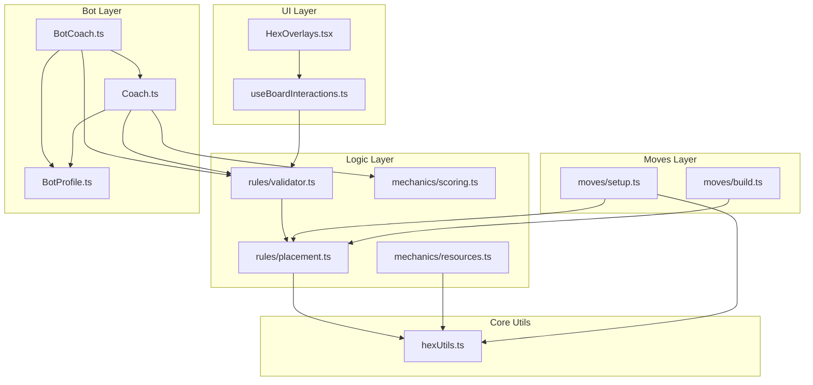

# Refactoring Plan: Catan Hex Mastery

This document outlines the purpose of key architectural files and provides a method-by-method refactoring plan focused on **Code Hygiene**, **DRY (Don't Repeat Yourself)**, and **Extensibility**.

---

## 1. `src/game/analysis/coach.ts`

### **Current Purpose**
This class analyzes the game board to provide strategic recommendations for settlement placement. It calculates scores based on mathematical heuristics like pip counts, resource scarcity, and resource diversity.

### **Method-by-Method Refactoring Plan**

#### `constructor(G: GameState)`
- **Current**: Accepts specific `GameState`. Hardcodes internal logic dependencies.
- **Refactor**:
    - **Inject Configuration**: Accept a `CoachConfig` object (weights for scarcity, synergy, etc.). This allows for different "Bot Personalities" (e.g., an "Aggressive" coach vs. a "Balanced" coach).

#### `private getPips(num: number)`
- **Current**: hardcoded map of dice roll probabilities.
- **Refactor**:
    - **Move to Utils**: This is generic Catan math. Move to `src/game/mechanics/probability.ts` or similar. It is likely needed by bots, UI, and other logic.

#### `getAllSettlementScores(playerID: string)`
- **Current**: Uses `getValidSetupSettlementSpots` from `validator.ts`.
- **Status**: **Completed**. Replaced manual iteration/validation loop with centralized validator.
- **Refactor**:
    - **Extract Scorers**: Break down into smaller scoring functions: `scorePips()`, `scoreScarcity()`, `scoreSynergy()`.
    - **Use Constants/Config**: Replace magic numbers (`SCARCITY_THRESHOLD`, multipliers) with the injected configuration.

#### `getBestSettlementSpots(playerID: string)`
- **Current**: Sorts and slices top 3.
- **Refactor**:
    - Keep as is, but ensure it relies on the refactored `getAllSettlementScores`.

---

## 2. `src/bots/BotCoach.ts`

### **Current Purpose**
Acts as the bridge between the raw analysis (`Coach`) and the bot's actions. It interprets the game state to decide *what* move to make (City vs. Settlement vs. Road) and *where* to make it.

### **Method-by-Method Refactoring Plan**

#### `recommendSettlementPlacement(playerID: string)`
- **Current**: Simply calls `Coach.getBestSettlementSpots`.
- **Refactor**:
    - **Enhance**: Allow passing a "Strategy" override. If the bot is desperate for Ore, it might prioritize Ore spots over pure high-score spots.
    - **Deduplication**: Remove the redundant `isValidSettlementLocation` check if `Coach.getBestSettlementSpots` (via `getAllSettlementScores`) already guarantees physical validity.

#### `recommendRoadPlacement(playerID: string)`
- **Current**: Iterates edges connected to the *last placed settlement*. This logic is brittle and specific to the Setup phase (mostly).
- **Refactor**:
    - **Generalize**: Use `validator.getValidSetupRoadSpots(G, playerID)` for Setup phase or `validator.getValidRoadSpots` for Gameplay.
    - **DRY**: Replace manual edge iteration and rule checking with the centralized validators.

#### `recommendNextMove(playerID: string)`
- **Current**: Hardcoded priority chain: `City > Settlement > Road`.
- **Refactor**:
    - **Strategy Pattern**: Implement a `DecisionEngine` or `BotProfile`.
    - **Weighted Randomness**: Calculate "Desire Score" based on `BotProfile`.
    - **DRY**: Use `src/game/rules/validator.ts` to find all valid moves first.

---

## 3. `src/components/HexOverlays.tsx`

### **Current Purpose**
The visual logic layer. It renders interactive elements (vertices, edges) over the hex grid.

### **Method-by-Method Refactoring Plan**

#### `HexOverlays` (Main Component)
- **Current**: Uses `useBoardInteractions` hook.
- **Refactor**:
    - **Strict Separation**: `HexOverlays` should **visualize**, not **decide**.
    - **DRY**: The `validSettlements` set should come from the SAME logic source as the Bot.
    - **Geometry**: Replace inline parsing (e.g. `id.split('::')`) with `hexUtils` calls.

#### `BuildingIcon`
- **Current**: Defined inside the file.
- **Refactor**:
    - **Extract**: Move to `src/components/board/BuildingIcon.tsx`.

#### Geometry Calculation (`React.useMemo` block)
- **Current**: Calculates corners and string splits (`id.split('::')`) inside the component.
- **Refactor**:
    - **Pre-calculation**: Move `corner` and `edge` mapping to a static lookup table or a context initialized once at game start.

---

## 4. `src/game/moves/setup.ts`

### **Current Purpose**
Handles moves specific to the Setup Phase (placing the first two settlements/roads).

### **Refactoring Plan**
- **Remove Duplication**: This file currently contains local helper functions (`getVertexNeighbors`, `getEdgesForVertex`) that duplicate `hexUtils`.
- **Logic Delegation**:
    - Use `hexUtils.ts` for all graph topology / geometry.
    - Use `placement.ts` (specifically `isValidSetupRoadPlacement`) for validation logic.
    - Ensure the "Road must connect to last placed settlement" rule is preserved.

---

## 5. `src/game/mechanics/resources.ts`

### **Current Purpose**
Handles resource distribution (dice rolls).

### **Refactoring Plan**
- **Consistency**: Ensure it imports `getVerticesForHex` from `hexUtils` rather than implementing any local geometry logic.

---

## Architecture & Dependencies

### **New/Refactored Files**
1.  **`src/game/rules/placement.ts`**: Pure functions determining if a move is valid (atomic checks).
2.  **`src/game/rules/validator.ts`**: Bulk move enumeration (returns Sets of valid IDs).
3.  **`src/game/mechanics/scoring.ts`**: Extracted math/scoring logic.
4.  **`src/hooks/useBoardInteractions.ts`**: React hook consuming `validator.ts`.
5.  **`src/bots/profiles/BotProfile.ts`**: Bot personality configuration.
6.  **`src/game/hexUtils.ts`**: **Immutable** grid geometry and graph traversal primitives ONLY. No game logic.

### **Dependency Graph**

## Next Steps
1.  **Refactor `BotCoach.recommendRoadPlacement`** to use `validator.getValidSetupRoadSpots`.
2.  **Refactor `BotCoach.recommendSettlementPlacement`** to remove redundant validity checks.
3.  **Optimize `HexOverlays`** geometry calculations (static lookup).
4.  **Extract `BuildingIcon`** from `HexOverlays`.
5.  **Refactor `setup.ts`** to remove duplicate helpers and use `placement.ts` and `hexUtils.ts`.
