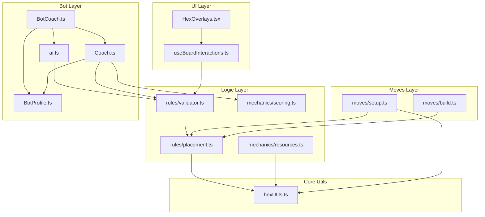

# Refactoring Plan: Catan Hex Mastery

This document outlines the purpose of key architectural files and provides a method-by-method refactoring plan focused on **Code Hygiene**, **DRY (Don't Repeat Yourself)**, and **Extensibility**.

---

## 1. `src/game/analysis/coach.ts`

### **Current Purpose**
This class analyzes the game board to provide strategic recommendations for settlement placement. It calculates scores based on mathematical heuristics like pip counts, resource scarcity, and resource diversity.

### **Refactoring Status: Completed**
- **Constructor**: Now accepts `CoachConfig` to allow for different bot personalities.
- **`getPips`**: Moved to `src/game/mechanics/scoring.ts`.
- **`getAllSettlementScores`**: Logic decomposed into smaller scoring methods (`scoreVertex`, `calculateScarcityScore`, etc.).
- **`getBestSettlementSpots`**: Updated to use the new scoring pipeline.

---

## 2. `src/bots/BotCoach.ts`

### **Current Purpose**
Acts as the bridge between the raw analysis (`Coach`) and the bot's actions. It interprets the game state to decide *what* move to make (City vs. Settlement vs. Road) and *where* to make it.

### **Refactoring Status: Completed & Diverged**
- **`recommendSettlementPlacement` / `recommendRoadPlacement`**: These methods were removed in favor of a more generic approach.
- **`filterOptimalMoves`**: Implemented a unified move filtering system. It consumes moves generated by `enumerate` (via `validator.ts`), assigns weights based on `BotProfile`, and optimizes specific moves (like `placeSettlement`) using `Coach` analysis.
- **Data Source**: Relies on `src/game/ai.ts` (and thus `validator.ts`) for move validity, ensuring 100% DRY compliance with game rules.

---

## 3. `src/components/HexOverlays.tsx`

### **Current Purpose**
The visual logic layer. It renders interactive elements (vertices, edges) over the hex grid.

### **Refactoring Status: Completed**
- **Logic Separation**: Now uses `useBoardInteractions` hook, decoupling validation logic from rendering.
- **`BuildingIcon`**: Extracted to `src/components/board/BuildingIcon.tsx`.
- **Geometry**: Implemented global static lookup table in `staticGeometry.ts` (using lazy-loaded caching) to eliminate per-instance calculation and improve render performance.

---

## 4. `src/game/moves/setup.ts`

### **Current Purpose**
Handles moves specific to the Setup Phase (placing the first two settlements/roads).

### **Refactoring Status: Completed**
- **Duplication**: Local geometry helpers removed. Now uses `hexUtils.ts`.
- **Validation**: Delegated to `placement.ts` and `hexUtils.ts`.

---

## 5. `src/game/mechanics/resources.ts`

### **Current Purpose**
Handles resource distribution (dice rolls).

### **Refactoring Status: Completed**
- **Consistency**: Updated to use `getVerticesForHex` from `hexUtils.ts`.

---

## 6. `src/game/ai.ts` (New Core Component)

### **Purpose**
Centralized move enumeration for AI agents (built-in and custom).

### **Refactoring Status: Completed & Fixed**
- **Enumerate**: Implemented to return valid moves for the current player/stage using `validator.ts`.
- **Return Format**: Updated to return `{ move: string, args: any[] }` (instead of Redux actions) to ensure compatibility with `boardgame.io`'s built-in bots (RandomBot, MCTSBot) used in the Debug Panel.
- **Integration**: `DebugBot` updated to pass these moves through without conversion.

---

## Architecture & Dependencies

### **Key Files**
1.  **`src/game/rules/placement.ts`**: Atomic move validation.
2.  **`src/game/rules/validator.ts`**: Bulk move enumeration (returns Sets of valid IDs).
3.  **`src/game/mechanics/scoring.ts`**: Generic scoring math (e.g. pips).
4.  **`src/hooks/useBoardInteractions.ts`**: React hook consuming `validator.ts`.
5.  **`src/bots/profiles/BotProfile.ts`**: Bot personality configuration.
6.  **`src/game/hexUtils.ts`**: **Immutable** grid geometry.

### **Dependency Graph**

## Next Steps
(All planned refactoring steps have been completed.)

## Recent Improvements
1.  **Refactor `Coach` Advice**: Extracted hardcoded advice strings into `src/game/analysis/adviceConstants.ts`.
2.  **Expand Tests**: Added comprehensive tests for `BotCoach` (gameplay settlements, invalid players, analysis fallback).
3.  **Security**: Centralized player ID validation in `src/utils/validation.ts`.
