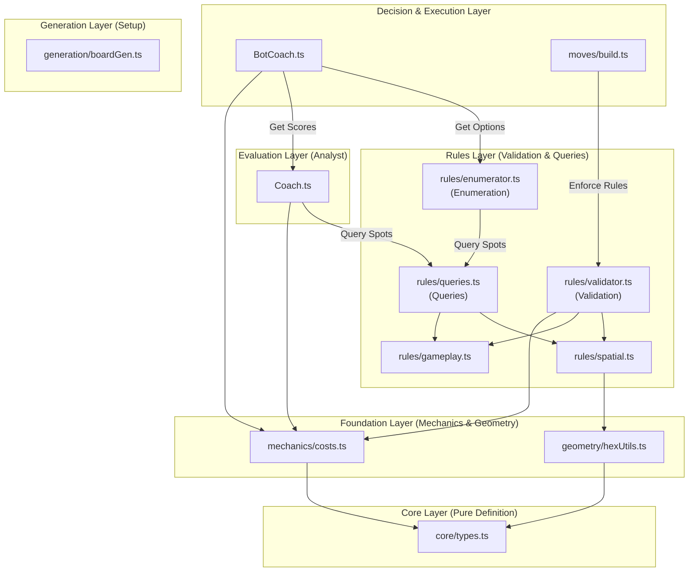

# Architecture Guide

Hex-Mastery follows a **Multi-Layer Architecture** (Layers -1 to 3) to separate concerns between Core Definitions, Foundation Mechanics, Rules Validation, Analysis Evaluation, and Decision Execution.

---

## 🏛️ Conceptual Architecture vs. Generated Evidence

This document pairs **hand-authored conceptual architecture** with **generated structural evidence**. Their distinction is explicit:

*   **Conceptual Architecture (Hand-Authored)**: Explains **why** responsibilities, boundaries, and directional rules exist. Conceptual diagrams change when architectural intent changes, not merely because a file moves without altering responsibilities.
*   **Generated Structural Evidence (Machine-Analyzed)**: Shows **what** the codebase currently depends on. Generated evidence is analyzed from source code and rendered automatically into derived diagrams.
*   **Neither replaces the other**: Conceptual models provide human intent; generated evidence provides verifiable current reality.

### Enforcement, Evidence, and Presentation Layers

| Layer | Component / Location | Responsibility |
| :--- | :--- | :--- |
| **Enforceable Policy** | `config/dependency-cruiser.cjs` | Owns strict architecture policy rules enforced during `npm run check:arch` and `npm run build`. |
| **Evidence Profile** | `config/dependency-cruiser.maritime.cjs` | Reuses the policy rules while narrowing generated evidence scope (excluding `.test` / `.spec` files). |
| **Canonical Evidence** | `.maritime/dependency-graph.json` | Pinned machine-readable evidence output generated by Dependency Maritime. |
| **Derived Presentations** | `docs/images/dependency-overview.svg`<br/>`docs/images/dependency-graph.svg` | Derived visual presentations generated from canonical `.maritime/` evidence. Must never be hand-edited. |

---

## 📐 Conceptual Layer Breakdown



### -1. Core Layer (Pure Definition)
*   **`src/game/core/types.ts`**: Global type definitions.
*   **`src/game/core/constants.ts`**: Game constants (e.g., `STAGES`, `PHASES`).
*   **`src/game/core/config.ts`**: Configuration (e.g., `BOARD_CONFIG`).
*   **Responsibility**: Vocabulary of the system. Instability $I=0$ (no internal dependencies).

### 0. Foundation Layer (Mechanics & Geometry)
*   **`src/game/geometry/*.ts`**: Pure spatial utilities (`math.ts`, `hexUtils.ts`, `staticGeometry.ts`).
*   **`src/game/mechanics/*.ts`**: Pure domain rules and static data (`resources.ts`, `costs.ts`, `scoring.ts`).
*   **Access**: Can be imported by any higher layer.

### 1. Generation Layer (Setup)
*   **`src/game/generation/boardGen.ts`**: Procedural board generation logic.
*   **Responsibility**: Creating initial game state.

### 1.5. Rules Layer (Validation & Enumeration)
*   **`src/game/rules/validator.ts`**: Facade for **Validation** (`RuleEngine.validateMove`).
*   **`src/game/rules/queries.ts`**: Facade for **Availability** (`getValidSettlementSpots`).
*   **`src/game/rules/enumerator.ts`**: **Generator** for legal turn actions.
*   **Internal Rules**: `gameplay.ts` (turn order, stages) and `spatial.ts` (distance rule, connectivity).
*   **Responsibility**: Enforce game rules and define legal possibilities.

### 2. Evaluation Layer (The "Analyst")
*   **`src/game/analysis/coach.ts`**: Scores actions based on game theory, pips, scarcity, and synergy.
*   **Responsibility**: Provide strategic advice and heatmaps. Consumes Rules layer to evaluate legal options.

### 3. Decision Layer (The "Bot" & Moves)
*   **`src/bots/BotCoach.ts`**: Selects best actions using bot personality weights, Coach strategy, and tactical heatmaps.
*   **`src/game/moves/*.ts`**: State mutation executors that delegate validation to `RuleEngine`.
*   **Invariant**: Code in `moves/` must **never** import from `bots/`.

---

## 🎨 UI Architecture & Feature Isolation

Frontend UI components are organized by **Feature Domain** (`src/features/`) rather than technical type:

*   **`src/features/board/`**: Board rendering, hex geometry, vertex/edge overlays, and heatmaps.
*   **`src/features/coach/`**: Coach panel, Analyst dashboard, production potential bars, and strategy tooltips.
*   **`src/features/game/`**: Screen orchestrators (`GameScreen.tsx`, `GameLayout.tsx`) assembling board, coach, and HUD.
*   **`src/features/hud/`**: Controls, dice roll banners, turn indicators, player panels, and notifications.
*   **`src/features/shared/`**: Generic, reusable UI primitives (buttons, tooltips, cards, modal drawers).

### Key Invariants

1.  **Feature Isolation**: Each feature (`board`, `coach`, `hud`) is self-contained. Cross-feature orchestration is managed by `src/features/game/GameScreen.tsx`.
2.  **Shared UI Primitives**: Reusable elements (`src/features/shared/`) cannot depend on specific feature domains or complex game state.
3.  **Strict UI/Logic Boundary**: Game logic (`src/game/`) is pure TypeScript and never imports React or UI components. UI components import game logic to render state, but logic does not bleed into component render trees.

### Runtime and Rendering Adapters

Application and feature code depend on Catan-owned contracts rather than vendor framework APIs:

*   **Runtime contracts**: Catan-owned interfaces (`GameContext`, `MoveContext`, `MoveHandler`, `GameCommands`, `GameViewProps`) live in `src/game/core/types.ts`. They expose typed Catan phases, per-player stages, lifecycle services, and commands without adopting vendor framework types.
*   **Runtime adapter**: `src/adapters/runtime/` isolates `boardgame.io` as the active underlying game engine runtime. It translates framework contexts and move invocations into Catan-owned contracts before delegating to views, rules, or move handlers. `GameClient.tsx` serves as the runtime composition root and `src/game/Game.ts` serves as the framework game-definition boundary while the runtime migration is unfinished. Bot runtime classes retain quarantined AI-framework coupling pending dedicated bot migration.
*   **Rendering adapter**: `src/adapters/rendering/hexgrid.ts` isolates `react-hexgrid` as the active underlying rendering implementation, exposing Catan-named `BoardSurface`, `BoardLayout`, and `HexTile` primitives so board components interact exclusively with local interfaces.
*   **Dependency direction**: Adapter modules depend inward on Catan domain contracts; domain and feature modules never depend on vendor packages or runtime adapter implementations. Features consume Catan view contracts. Enforceable policy in `config/dependency-cruiser.cjs` rejects direct vendor framework imports from application code and rejects domain-to-adapter dependencies.

---

## 📂 Project Structure and File Placement Guide

To answer where a new concept or component belongs:

```
src/
├── adapters/           # External runtime and rendering integration gateways
├── game/               # Pure Game Engine (No React dependencies)
│   ├── core/           # Vocabulary (types, constants, config) — Layer -1
│   ├── geometry/       # Spatial math & hex utilities — Layer 0
│   ├── mechanics/      # Game mechanics (costs, scoring) — Layer 0
│   ├── generation/     # Setup & board generation — Layer 1
│   ├── rules/          # Rule validation, queries & enumeration — Layer 1.5
│   ├── analysis/       # Strategic evaluation (Coach, Analyst) — Layer 2
│   └── moves/          # Move execution handlers — Layer 3
├── bots/               # AI decision layer & bot profiles — Layer 3
├── features/           # UI Domain Feature Modules
│   ├── board/          # Hex grid SVG & interactive overlays
│   ├── coach/          # Strategy coach & analyst panel UI
│   ├── game/           # Main game screen orchestrators (GameScreen.tsx)
│   ├── hud/            # Controls, player stats, notifications
│   └── shared/         # Reusable UI primitives (buttons, modals, hooks)
├── pages/              # Top-level page views (SetupPage.tsx, GamePage.tsx)
└── GameClient.tsx      # Game client composition root
```

---

## 📊 Generated Structural Diagrams

These diagrams present the current dependency structure observed in the codebase.

### High-Level Overview


*Generated by Maritime's `architecture-overview` profile from `.maritime/dependency-graph.json`. Aggregates file-level relationships into folder nodes for major structural scanning.*

### Detailed Dependency Graph


*Generated by Maritime's `compact-architecture` profile from `.maritime/dependency-graph.json`. Preserves file-level nodes while removing external package noise.*

---

## 🔍 Architecture Verification

Architecture policies are enforced programmatically using `dependency-cruiser`:

```bash
# Verify architecture rules
npm run check:arch

# Full build (includes check:arch)
npm run build
```

The authoritative rules live in `config/dependency-cruiser.cjs`. Violations will fail the build process.
