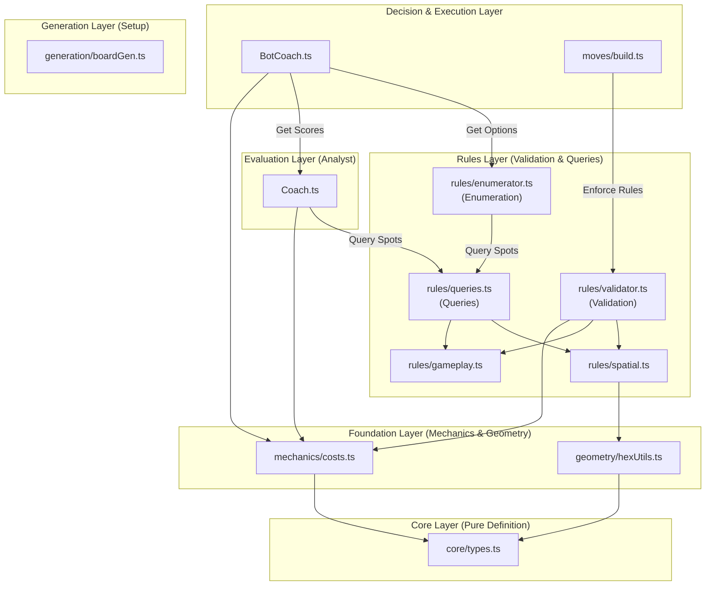
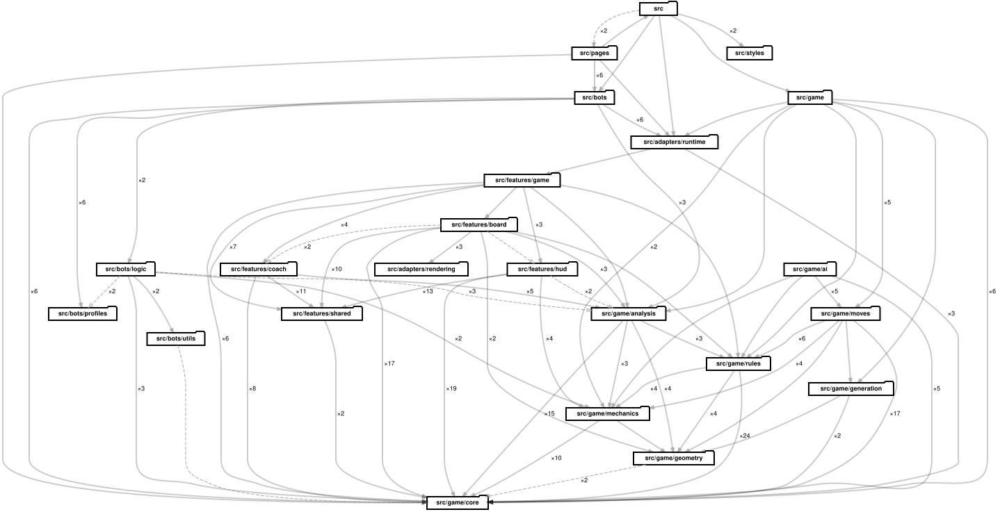

# Architecture Guide

Hex-Mastery follows a **Multi-Layer Architecture** (Layers -1 to 3) to separate concerns between Core Definitions, Foundation Mechanics, Rules Validation, Analysis Evaluation, and Decision Execution.

---

## 🏛️ Conceptual Architecture vs. Generated Evidence

This document pairs **hand-authored conceptual architecture** with **generated structural evidence**. Their distinction is explicit:

*   **Conceptual Architecture (Hand-Authored)**: Explains **why** responsibilities, boundaries, and directional rules exist. Conceptual diagrams change when architectural intent changes, not merely because a file moves without altering responsibilities.
*   **Generated Structural Evidence (Machine-Analyzed)**: Shows **what** the codebase currently depends on. Generated evidence is analyzed from source code and rendered automatically into derived diagrams.
*   **Neither replaces the other**: Conceptual models provide human intent; generated evidence provides verifiable current reality.

### Enforcement, Evidence, and Presentation Layers

| Layer | Component / Location | Responsibility |
| :--- | :--- | :--- |
| **Enforceable Policy** | `config/dependency-cruiser.cjs` | Owns strict architecture policy rules enforced during `npm run check:arch` and `npm run build`. |
| **Evidence Profile** | `config/dependency-cruiser.maritime.cjs` | Reuses the policy rules while narrowing generated evidence scope (excluding `.test` / `.spec` files). |
| **Canonical Evidence** | `.maritime/dependency-graph.json` | Pinned machine-readable evidence output generated by Dependency Maritime. |
| **Derived Presentations** | `docs/images/dependency-overview.svg`<br/>`docs/images/dependency-graph.svg` | Derived visual presentations generated from canonical `.maritime/` evidence. Must never be hand-edited. |

---

## 📐 Conceptual Layer Breakdown



### -1. Core Layer (Pure Definition)
*   **`src/game/core/types.ts`**: Global type definitions.
*   **`src/game/core/constants.ts`**: Game constants (e.g., `STAGES`, `PHASES`).
*   **`src/game/core/config.ts`**: Configuration (e.g., `BOARD_CONFIG`).
*   **Responsibility**: The vocabulary of the system. Instability $I=0$ (no internal dependencies).

### 0. Foundation Layer (Mechanics & Geometry)
*   **`src/game/geometry/*.ts`**: Pure spatial utilities (`math.ts`, `hexUtils.ts`, `staticGeometry.ts`).
*   **`src/game/mechanics/*.ts`**: Pure domain rules and static data (`resources.ts`, `costs.ts`, `scoring.ts`).
*   **Access**: Can be imported by any higher layer.

### 1. Generation Layer (Setup)
*   **`src/game/generation/boardGen.ts`**: Procedural board generation logic.
*   **Responsibility**: Creating initial game state.

### 1.5. Rules Layer (Validation & Enumeration)
*   **`src/game/rules/validator.ts`**: The Facade for **Validation** (`RuleEngine.validateMove`).
*   **`src/game/rules/queries.ts`**: The Facade for **Availability** (`getValidSettlementSpots`).
*   **`src/game/rules/enumerator.ts`**: The **Generator** for legal turn actions.
*   **Internal Rules**: `gameplay.ts` (turn order, stages) and `spatial.ts` (distance rule, connectivity).
*   **Responsibility**: Enforce game rules and define legal possibilities.

### 2. Evaluation Layer (The "Analyst")
*   **`src/game/analysis/coach.ts`**: Scores actions based on game theory, pips, scarcity, and synergy.
*   **Responsibility**: Provide strategic advice and heatmaps. Consumes the Rules layer to evaluate legal options.

### 3. Decision Layer (The "Bot" & Moves)
*   **`src/bots/BotCoach.ts`**: Selects best actions using bot personality weights, Coach strategy, and tactical heatmaps.
*   **`src/game/moves/*.ts`**: State mutation executors that delegate validation to `RuleEngine`.
*   **Invariant**: Code in `moves/` must **never** import from `bots/`.

---

## 🎨 UI Architecture & Boundaries

Frontend UI components are organized by **Feature Domain** (`src/features/`) rather than technical type.

### Key Invariants

1.  **Feature Isolation**: Each feature (`board`, `coach`, `hud`) is self-contained. Cross-feature orchestration is managed by container components like `src/features/game/components/GameScreen.tsx`.
2.  **Shared Components**: Primitive UI elements (`src/shared/`) cannot depend on `src/features/` or complex game logic.
3.  **Strict UI/Logic Boundary**: Game logic (`src/game/`) is pure TypeScript and never imports React or UI components. UI components import game logic to render state, but logic does not bleed into component render trees.

### Logic Extraction Guidelines
*   Complex calculations (Coach scoring loops, animation effects) are extracted into dedicated custom hooks in `src/features/{feature}/hooks/`.
*   Components render purely determined by their props, using `React.memo` where appropriate for heavy board rendering.

---

## 📊 Generated Structural Diagrams

These diagrams present the current dependency structure observed in the codebase.

### High-Level Overview



*Generated by Maritime's `architecture-overview` profile from `.maritime/dependency-graph.json`. It aggregates file-level relationships into folder nodes for major structural scanning.*

### Detailed Dependency Graph


*Generated by Maritime's `compact-architecture` profile from `.maritime/dependency-graph.json`. It preserves file-level nodes while removing external package noise.*

---

## 🔍 Architecture Verification

Architecture policies are enforced programmatically using `dependency-cruiser`:

```bash
# Verify architecture rules
npm run check:arch

# Full build (includes check:arch)
npm run build
```

The authoritative rules live in `config/dependency-cruiser.cjs`. Violations will fail the build process.
