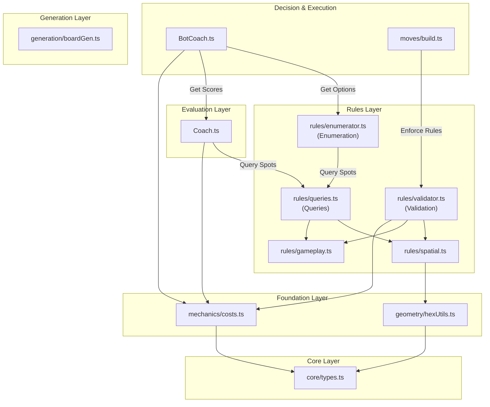

# Development Guide

This guide covers the technical architecture, setup instructions, and contribution guidelines for **Hex-Mastery**.

## 🛠 Tech Stack

The project is built on a modern React stack, leveraging `boardgame.io` for state management and networking.

*   **Frontend**: React + TypeScript + Vite
*   **Game Engine**: [boardgame.io](https://boardgame.io/) (State Management, Move Validation, Multiplayer Networking)
*   **Visualization**: `react-hexgrid` (SVG-based board rendering)
*   **Styling**: Tailwind CSS
*   **Testing**: Jest (Unit), Playwright (E2E)

## 🚀 Getting Started

### Prerequisites

*   Node.js (v18+)
*   npm

### Installation

1.  **Clone the repository:**
    ```bash
    git clone https://github.com/your-username/hex-mastery.git
    cd hex-mastery
    ```

2.  **Install dependencies:**
    ```bash
    npm install
    # OR run the setup script which also installs Playwright browsers
    ./scripts/setup.sh
    ```

3.  **Run the development server:**
    ```bash
    npm run dev
    ```
    Open `http://localhost:5173` to view the app.

## 🧪 Testing

We use a dual-layer testing strategy:

*   **Unit Tests (Jest)**: Focus on game logic (moves, scoring, geometry).
    ```bash
    npm test
    ```
*   **E2E Tests (Playwright)**: Focus on UI interactions, board rendering, and "Coach Mode" overlays.
    ```bash
    npm run test:e2e
    ```

## 🏗 Architecture

The project follows a **Multi-Layer Architecture** (Layers -1 to 3) to separate concerns between Foundation, Rules, Analysis, and Decision.

### -1. Core Layer (Pure Definition)
*   **`src/game/core/types.ts`**: Global type definitions.
*   **`src/game/core/constants.ts`**: Game constants (e.g., `STAGES`, `PHASES`).
*   **`src/game/core/config.ts`**: Configuration (e.g., `BOARD_CONFIG`).
*   **Responsibility**: The vocabulary of the system. I=0 (No dependencies).

### 0. Foundation Layer (Mechanics & Geometry)
*   **`src/game/geometry/*.ts`**: Pure math and spatial utilities.
    *   `math.ts`, `hexUtils.ts`, `staticGeometry.ts`.
*   **`src/game/mechanics/*.ts`**: Pure logic and static data.
    *   `resources.ts`, `costs.ts`, `scoring.ts`.
*   **Access**: Can be imported by **any** higher layer.

### 1. Generation Layer (Setup)
*   **`src/game/generation/boardGen.ts`**: Procedural board generation logic.
*   **Responsibility**: Creating the initial state.

### 1.5. Rules Layer (Validation & Enumeration)
*   **`src/game/rules/validator.ts`**: The Facade (Single Source of Truth) for **Validation**.
    *   It exposes `RuleEngine.validateMove` and `RuleEngine.validateMoveOrThrow`.
*   **`src/game/rules/queries.ts`**: The Facade for **Availability** (Queries).
    *   It exposes helper functions like `getValidMovesForStage`, `getValidSettlementSpots`.
    *   Used by the UI to highlight spots and by the Enumerator to list moves.
*   **`src/game/rules/enumerator.ts`**: The **Generator**.
    *   It enumerates all legally possible actions for a turn by consuming `queries.ts` and `constants.ts`.
*   **Internal Rules**:
    *   `gameplay.ts`: Validates state-aware moves (e.g., turn order).
    *   `spatial.ts`: Validates geometric rules using Foundation (e.g., "Is this spot connected?").
*   **Responsibility**: Enforce the rules of the game and define what is possible.

### 2. Evaluation Layer (The "Analyst")
*   **`src/game/analysis/coach.ts`**: The "Brain". It scores actions based on game theory:
    *   **Strategic Advice**: "Build Roads" vs "Build Cities" (High-level strategy).
    *   **Spatial Scoring**: Heatmaps for specific board spots (pips, scarcity).
    *   It exposes `scoreAction` and `getStrategicAdvice`.
    *   It consumes **Rules Layer** (Enumeration/Queries) to know what to score.

### 3. Decision Layer (The "Bot" & Moves)
*   **`src/bots/BotCoach.ts`**: The "Bridge". It selects the best move from the Enumerator layer by:
    *   Applying `BotProfile` weights (Personality).
    *   Boosting moves recommended by the `Coach` (Strategy).
    *   Refining top candidates using `Coach` heatmaps (Tactics).
*   **`src/game/moves/*.ts`**: The "Execution Layer". These files are dumb executors that mutate state after delegating validation to the `RuleEngine`.

### Architecture Diagram




### Architecture Verification

We enforce this architecture using `dependency-cruiser`. This ensures that lower layers never accidentally import from higher layers.

*   **Command Line**: You can verify the architecture manually by running:
    ```bash
    npm run check:arch
    ```
*   **Automated Check**: This check is automatically run as part of the build process (`npm run build`).
*   **VS Code Extension**: For real-time feedback, we recommend installing the [Dependency Cruiser extension](https://marketplace.visualstudio.com/items?itemName=sverweij.dependency-cruiser-extension) for VS Code.
*   **Configuration**: The rules are defined in `config/dependency-cruiser.cjs`.

## 📂 Project Structure & Namespace Best Practices

### Ideal Structure

We aim for small, focused classes with specific responsibilities.

```
src/
├── features/           # UI Domains (Feature-Based Architecture)
│   ├── board/          # Board rendering & overlays
│   ├── coach/          # Analyst dashboard & coach bot UI
│   ├── game/           # Main Game Screen & Layout
│   └── hud/            # Game controls, player panels, notifications
├── game/               # Game Logic
│   ├── core/           # Types, Constants, Config (Layer -1)
│   ├── geometry/       # Pure Math: math.ts, hexUtils.ts (Layer 0)
│   ├── generation/     # Setup: boardGen.ts (Layer 1)
│   ├── mechanics/      # Foundation: costs.ts, resources.ts, scoring.ts (Layer 0)
│   ├── rules/          # Validation & Enumeration: validator.ts, queries.ts (Layer 1.5)
│   ├── analysis/       # Evaluation: coach.ts, analyst.ts (Layer 2)
│   └── moves/          # Execution: build.ts, trade.ts (Layer 3)
└── shared/             # Generic UI components (buttons, icons, etc.)
```

### Namespace Guidelines
1.  **Keep Root Clean**: `src/game/` should only contain the main `Game.ts`. Auxiliaries like `types.ts` or `constants.ts` should live in `src/game/core/`.
2.  **Group by Domain**:
    *   **Math** goes to `geometry/`.
    *   **Setup Logic** goes to `generation/`.
    *   **Game Rules** (Costs, Etc) go to `mechanics/`.
3.  **No Monoliths**: Avoid "Utils" folders that become dumping grounds. `hexUtils` is acceptable because it is specific to the Hexagonal Grid domain, but `gameUtils` would be an anti-pattern.

## 🎨 UI Architecture (Feature-Based)

To maintain a clean and scalable frontend, we organize UI components by **Feature Domain** (`src/features/`) rather than by technical type (e.g., no `src/components`).

### Key Concepts

1.  **Feature Isolation**: Each feature (e.g., `board`, `coach`, `hud`) should be self-contained.
    *   Cross-feature imports should be minimized or orchestrated by a parent container.
    *   `src/features/game/components/GameScreen.tsx` acts as the **Orchestrator**, assembling the Board, HUD, and Coach panels into a cohesive page.

2.  **Shared Components**: Generic UI elements (Buttons, Tooltips, Icons) that are used across multiple features reside in `src/shared`.
    *   `src/shared` **cannot** depend on `src/features` or complex Game Logic.

3.  **Strict Layering**:
    *   **Game Logic (`src/game`)** is the "Backend" (pure TS). It **never** imports UI.
    *   **UI (`src/features`)** imports Game Logic to render state, but logic should not bleed into components.

### UI Best Practices & Cleaning Strategies

To keep UI components (especially the Orchestrator `GameScreen.tsx`) clean:

1.  **Logic Extraction via Custom Hooks**:
    *   **Do not** write complex calculations (e.g., Coach scoring loops, Dice roll effects) inside the component body.
    *   **Do** extract this logic into a custom hook (e.g., `useCoachData`, `useGameEffects`) placed in `src/features/{feature}/hooks/`.
    *   *Example:* `useCoachData` takes `G` and `ctx` and returns a memoized `CoachData` object, keeping `GameScreen` focused purely on passing props.

2.  **Pure Rendering**:
    *   Components should ideally be functional and determined solely by their props.
    *   Use `React.memo` for expensive components (like `GameHex`) to prevent unnecessary re-renders.

3.  **Facade Pattern**:
    *   When a component needs data from multiple complex sources, create a Hook or a Helper Class to act as a Facade, providing a simple API to the component.

## 🗺️ Development Roadmap

### Completed Refactoring ✅
- [x] **Unified Move Architecture**: Separated Validation (Rules) from Execution (Moves).
- [x] **God Object Split**: `rules/validator.ts` split into `RuleEngine` (Validation) and `Queries` (Availability).
- [x] **Namespace Restructure**: Implemented the "Ideal Structure" (`Core`, `Geometry`, `Generation`) to separate concerns and stabilize the dependency graph.
- [x] **UI Migration**: Migrated `src/components` to `src/features` (Board, Coach, Game, HUD).
- [x] **GameScreen Refactor**: Extracted complex logic (Coach Data, Game Effects) from `GameScreen.tsx` into dedicated hooks (`useCoachData`, `useGameEffects`).

### Strategic Refactoring (Complexity Reduction) 📉
To improve the [Repo Health Score](./COMPLEXITY.md), we are targeting files with high coupling and complexity.

*   **Primary Target**: `src/features/game/components/GameScreen.tsx` (Formerly `Board.tsx`)
    *   **Issue**: Acts as the central hub, prone to "God Component" growth.
    *   **Strategy**: Continuously extract logic into `src/features/{feature}/hooks/` as new features (Trade, Dev Cards) are added.
*   **Secondary Target**: `src/features/hud/components/GameControls.tsx`
    *   **Issue**: High Cyclomatic Complexity (handling many move types).
    *   **Strategy**: Extract logic into custom hooks (e.g., `useBuildActions`, `useTurnActions`).

### Current Focus: Phase 7 (Full Game Loop) 🚧
- [x] **Robber Mechanics**:
    - [x] Resource Discarding (Players with >7 cards must discard half on roll of 7).
    - [x] Stealing (Active player steals 1 random resource from a player on the target hex).
- [ ] **Trade System**:
    - [ ] Player-to-Player trading (Offer, Counter-Offer, Accept/Reject).
    - [ ] Trade interface and notification system.
- [ ] **Development Cards**:
    - [ ] Deck management & random shuffling.
    - [ ] "Buy Dev Card" move.
    - [ ] Cards include: Knight (Move Robber), Road Building, Year of Plenty, Monopoly, Victory Point.
- [ ] **Special Awards**:
    - [ ] **Longest Road**: Dynamic pathfinding algorithm to track continuous road segments.
    - [ ] **Largest Army**: Tracking played Knight cards.
- [ ] **Win Conditions**:
    - [ ] Integrate Special Awards into VP calculation.

## 🤝 Contributing

1.  Create a feature branch (`git checkout -b feature/amazing-feature`).
2.  Ensure all tests pass (`npm test` & `npm run test:e2e`).
3.  Commit your changes.
4.  Open a Pull Request.

---
*For high-level strategy and game theory documentation, see [STRATEGY_ENGINE.md](./STRATEGY_ENGINE.md).*
