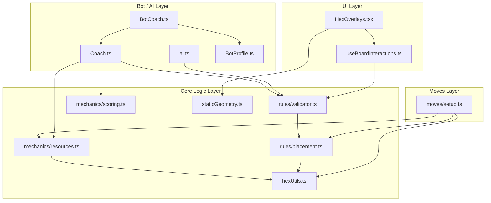

# Development Guide

This guide covers the technical architecture, setup instructions, and contribution guidelines for **Hex-Mastery**.

## 🛠 Tech Stack

The project is built on a modern React stack, leveraging `boardgame.io` for state management and networking.

*   **Frontend**: React + TypeScript + Vite
*   **Game Engine**: [boardgame.io](https://boardgame.io/) (State Management, Move Validation, Multiplayer Networking)
*   **Visualization**: `react-hexgrid` (SVG-based board rendering)
*   **Styling**: Tailwind CSS
*   **Testing**: Jest (Unit), Playwright (E2E)

## 🚀 Getting Started

### Prerequisites

*   Node.js (v18+)
*   npm

### Installation

1.  **Clone the repository:**
    ```bash
    git clone https://github.com/your-username/hex-mastery.git
    cd hex-mastery
    ```

2.  **Install dependencies:**
    ```bash
    npm install
    # OR run the setup script which also installs Playwright browsers
    ./scripts/setup.sh
    ```

3.  **Run the development server:**
    ```bash
    npm run dev
    ```
    Open `http://localhost:5173` to view the app.

## 🧪 Testing

We use a dual-layer testing strategy:

*   **Unit Tests (Jest)**: Focus on game logic (moves, scoring, geometry).
    ```bash
    npm test
    ```
*   **E2E Tests (Playwright)**: Focus on UI interactions, board rendering, and "Coach Mode" overlays.
    ```bash
    npm run test:e2e
    ```

## 🏗 Architecture

The project follows a strict separation of concerns between Game Logic (Rules), Strategic Analysis (AI/Coach), and Presentation (UI).

### 1. Logic Layer (The "What")
*   **`src/game/rules/validator.ts`**: The source of truth for move legality. It calculates *all* valid moves (e.g., "Where can I build a settlement?"). It generates `Set`s of valid IDs.
*   **`src/game/rules/placement.ts`**: Atomic validation for individual moves (used by `validator.ts` and `moves/setup.ts`).
*   **`src/game/mechanics/scoring.ts`**: Pure mathematical utilities for game mechanics (e.g., calculating pips from dice numbers).
*   **`src/game/hexUtils.ts`**: Immutable grid geometry helpers.

### 2. Strategy Layer (The "Why")
*   **`src/game/analysis/coach.ts`**: The "brain". It evaluates the board state to score potential moves based on heuristics:
    *   **Scarcity**: How rare is a resource?
    *   **Diversity**: Do I have a variety of numbers/resources?
    *   **Synergy**: Do my resources match my building goals?
    *   It does *not* decide legality; it only scores moves provided by the Logic Layer.
*   **`src/bots/BotCoach.ts`**: The bridge between strategy and action. It filters the list of legal moves (provided by `ai.ts`) and ranks them using `Coach` analysis (for complex moves like settlements) or `BotProfile` weights (for simple moves like buying dev cards).
*   **`src/game/ai.ts`**: The "enumerator". It generates the raw list of all legal actions (`GameAction[]`) for the current turn. This file is critical for `boardgame.io` bot integration.

### 3. Presentation Layer (The "How")
*   **`src/components/HexOverlays.tsx`**: The visualization engine. It renders interactive elements (vertices/edges) over the SVG grid.
    *   **Performance**: Uses `src/game/staticGeometry.ts` for O(1) geometry lookups (cached).
    *   **Interactivity**: Uses `src/hooks/useBoardInteractions.ts` to determine which spots are clickable based on the Logic Layer.
    *   **Feedback**: Displays `Coach` heatmaps and recommendations.

### Dependency Diagram



## 📂 Project Structure

```
src/
├── bots/           # AI implementations (RandomBot, DebugBot)
├── components/     # React UI components (Board, GameControls)
├── game/           # Core Game Logic
│   ├── analysis/   # Coach & Scoring Heuristics
│   ├── mechanics/  # Rules (Resources, Building)
│   ├── moves/      # boardgame.io Move Definitions
│   ├── config.ts   # Global constants (Board size, Costs)
│   └── Game.ts     # Main boardgame.io Game Object
├── styles/         # CSS & Tailwind config
└── App.tsx         # Main entry point
```

## 🗺️ Development Roadmap

### Completed Phases ✅
*   **Phase 1: Geometry Core** (Cube Coordinates, Fairness Algorithms)
*   **Phase 2: Setup Engine** (Snake Draft, Distance Rules)
*   **Phase 3: Analyst Module** (Pip Counting, Scarcity Metrics)
*   **Phase 4: Coaching Layer** (Heuristic Scoring, Heatmaps)

### Current Focus: Phase 5 (UI/UX) 🚧
*   Refining Mobile Layouts (Drawer/Sidebar logic).
*   Polishing visual feedback (Tooltips, Toasts).

### Upcoming: Phase 6 (Full Loop) 🔮
*   Trade Phase implementation.
*   Robber mechanics.
*   Victory Point tracking & Win Conditions.

## 🤝 Contributing

1.  Create a feature branch (`git checkout -b feature/amazing-feature`).
2.  Ensure all tests pass (`npm test` & `npm run test:e2e`).
3.  Commit your changes.
4.  Open a Pull Request.

---
*For high-level strategy and game theory documentation, see [STRATEGY_ENGINE.md](./STRATEGY_ENGINE.md).*
