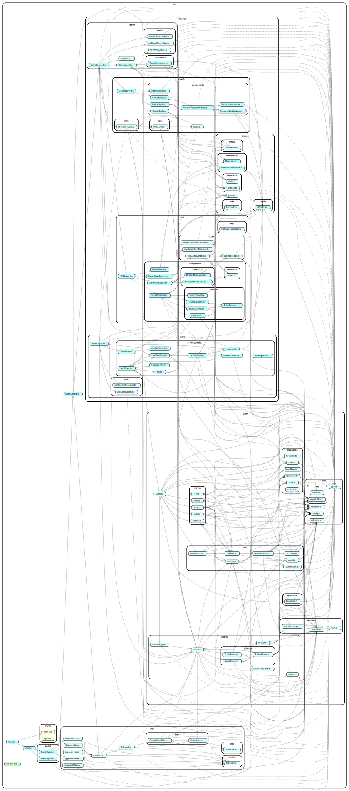
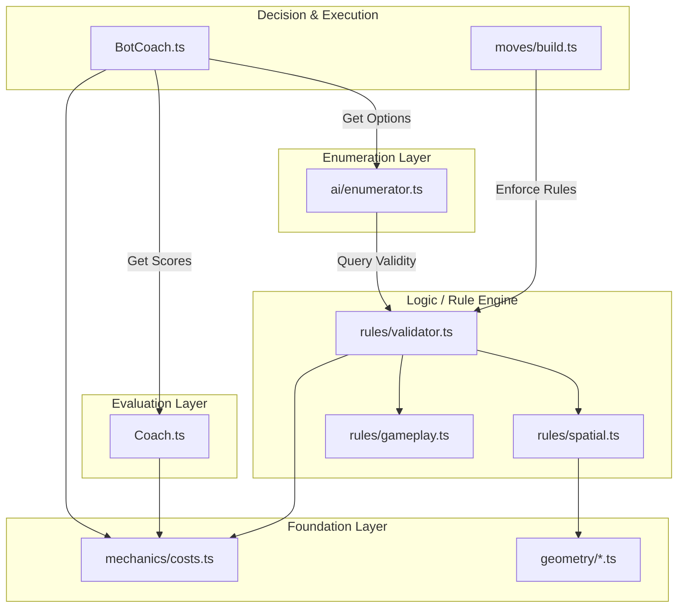

# Development Guide

This guide covers the technical architecture, setup instructions, and contribution guidelines for **Hex-Mastery**.

## 🛠 Tech Stack

The project is built on a modern React stack, leveraging `boardgame.io` for state management and networking.

*   **Frontend**: React + TypeScript + Vite
*   **Game Engine**: [boardgame.io](https://boardgame.io/) (State Management, Move Validation, Multiplayer Networking)
*   **Visualization**: `react-hexgrid` (SVG-based board rendering)
*   **Styling**: Tailwind CSS
*   **Testing**: Jest (Unit), Playwright (E2E)

## 🚀 Getting Started

### Prerequisites

*   Node.js (v18+)
*   npm

### Installation

1.  **Clone the repository:**
    ```bash
    git clone https://github.com/your-username/hex-mastery.git
    cd hex-mastery
    ```

2.  **Install dependencies:**
    ```bash
    npm install
    # OR run the setup script which also installs Playwright browsers
    ./scripts/setup.sh
    ```

3.  **Run the development server:**
    ```bash
    npm run dev
    ```
    Open `http://localhost:5173` to view the app.

## 🧪 Testing

We use a dual-layer testing strategy:

*   **Unit Tests (Jest)**: Focus on game logic (moves, scoring, geometry).
    ```bash
    npm test
    ```
*   **E2E Tests (Playwright)**: Focus on UI interactions, board rendering, and "Coach Mode" overlays.
    ```bash
    npm run test:e2e
    ```

## 🏗 Architecture

The project follows a **5-Layer Architecture** (Layers 0-4) to separate concerns between Foundation, Validation, Enumeration, Evaluation, and Decision.

### 0. Foundation Layer (Mechanics & Geometry)
*   **`src/game/mechanics/*.ts`**: Pure logic and static data.
    *   `resources.ts`, `costs.ts`, `scoring.ts`.
    *   Provides primitives like "What does a road cost?" or "Is this trade valid?".
*   **`src/game/geometry/*.ts`** (Proposed): Math and spatial utilities.
    *   `hexUtils.ts`, `geometry.ts`.
    *   Provides "Get neighbors", "Calculate distance".
*   **Access:** Can be imported by **any** higher layer.

### 1. Rules Layer (The "Validator")
*   **`src/game/rules/validator.ts`**: The Facade (Single Source of Truth) for **Validation**.
    *   It exposes `RuleEngine.validateMove` and `RuleEngine.validateMoveOrThrow`.
*   **Internal Rules**:
    *   `gameplay.ts`: Validates state-aware moves (e.g., turn order).
    *   `spatial.ts`: Validates geometric rules using Foundation (e.g., "Is this spot connected?").
*   **Responsibility**: Enforce the rules of the game. It uses Layer 0 for data but adds the "Permission" logic.

### 2. Enumeration Layer (The "Generator")
*   **`src/game/ai/enumerator.ts`**: Generates all legally possible actions for a turn.
    *   It iterates through `STAGE_MOVES` (constants).
    *   It uses `RuleEngine` to find valid arguments (e.g., "Which edges can I build a road on?").
    *   It powers the Bot's decision tree.

### 3. Evaluation Layer (The "Analyst")
*   **`src/game/analysis/coach.ts`**: The "Brain". It scores actions based on game theory:
    *   **Strategic Advice**: "Build Roads" vs "Build Cities" (High-level strategy).
    *   **Spatial Scoring**: Heatmaps for specific board spots (pips, scarcity).
    *   It exposes `scoreAction` and `getStrategicAdvice`.

### 4. Decision Layer (The "Bot")
*   **`src/bots/BotCoach.ts`**: The "Bridge". It selects the best move from the Enumerator layer by:
    *   Applying `BotProfile` weights (Personality).
    *   Boosting moves recommended by the `Coach` (Strategy).
    *   Refining top candidates using `Coach` heatmaps (Tactics).
*   **`src/game/moves/*.ts`**: The "Execution Layer". These files are dumb executors that mutate state after delegating validation to the `RuleEngine`.

### Architecture Diagram





### Architecture Verification

We enforce this architecture using `dependency-cruiser`. This ensures that lower layers never accidentally import from higher layers.

*   **Command Line**: `npm run check:arch`
*   **Configuration**: `config/dependency-cruiser.cjs`

## 📂 Project Structure & Namespace Best Practices

### Ideal Structure

We aim for small, focused classes with specific responsibilities.

```
src/
├── game/
│   ├── core/           # (Proposed) Constants, Types, Config
│   ├── geometry/       # (Proposed) Pure Math: geometry.ts, hexUtils.ts
│   ├── generation/     # (Proposed) Setup: boardGen.ts
│   ├── mechanics/      # Foundation: costs.ts, resources.ts, scoring.ts
│   ├── rules/          # Validation: validator.ts (Facade), spatial.ts
│   ├── ai/             # Enumeration: enumerator.ts
│   ├── analysis/       # Evaluation: coach.ts, analyst.ts
│   ├── moves/          # Execution: build.ts, trade.ts
│   └── Game.ts         # Main Entry Point
```

### Namespace Guidelines
1.  **Keep Root Clean**: `src/game/` should only contain the main `Game.ts`. Auxiliaries like `types.ts` or `constants.ts` should live in `src/game/core/`.
2.  **Group by Domain**:
    *   **Math** goes to `geometry/`.
    *   **Setup Logic** goes to `generation/`.
    *   **Game Rules** (Costs, Etc) go to `mechanics/`.
3.  **No Monoliths**: Avoid "Utils" folders that become dumping grounds. `hexUtils` is acceptable because it is specific to the Hexagonal Grid domain, but `gameUtils` would be an anti-pattern.

## 🗺️ Development Roadmap

### Refactoring Roadmap (To-Do) 🛠️
To align with the Ideal Structure, we plan the following moves:

- [ ] **Geometry Cleanup**:
    - Move `src/game/geometry.ts` -> `src/game/geometry/index.ts` (or `math.ts`)
    - Move `src/game/staticGeometry.ts` -> `src/game/geometry/static.ts`
    - Move `src/game/hexUtils.ts` -> `src/game/geometry/hexUtils.ts`
- [ ] **Generation Cleanup**:
    - Move `src/game/boardGen.ts` -> `src/game/generation/boardGen.ts`
- [ ] **Core Cleanup**:
    - Move `src/game/types.ts` -> `src/game/core/types.ts`
    - Move `src/game/constants.ts` -> `src/game/core/constants.ts`
    - Move `src/game/config.ts` -> `src/game/core/config.ts`
- [ ] **Dependency Cruiser**: Update `config/dependency-cruiser.cjs` aliases to reflect these new paths.

### Current Focus: Phase 7 (Full Game Loop) 🚧
- [x] **Robber Mechanics**:
    - [x] Resource Discarding.
    - [x] Stealing.
- [ ] **Trade System**:
    - [ ] Player-to-Player trading.
    - [ ] Trade interface.
- [ ] **Development Cards**:
    - [ ] "Buy Dev Card" move.
    - [ ] Card Effects (Knight, etc).
- [ ] **Win Conditions**:
    - [ ] Longest Road / Largest Army.

## 🤝 Contributing

1.  Create a feature branch.
2.  Ensure tests pass (`npm test` & `npm run test:e2e`).
3.  Commit and Open PR.
