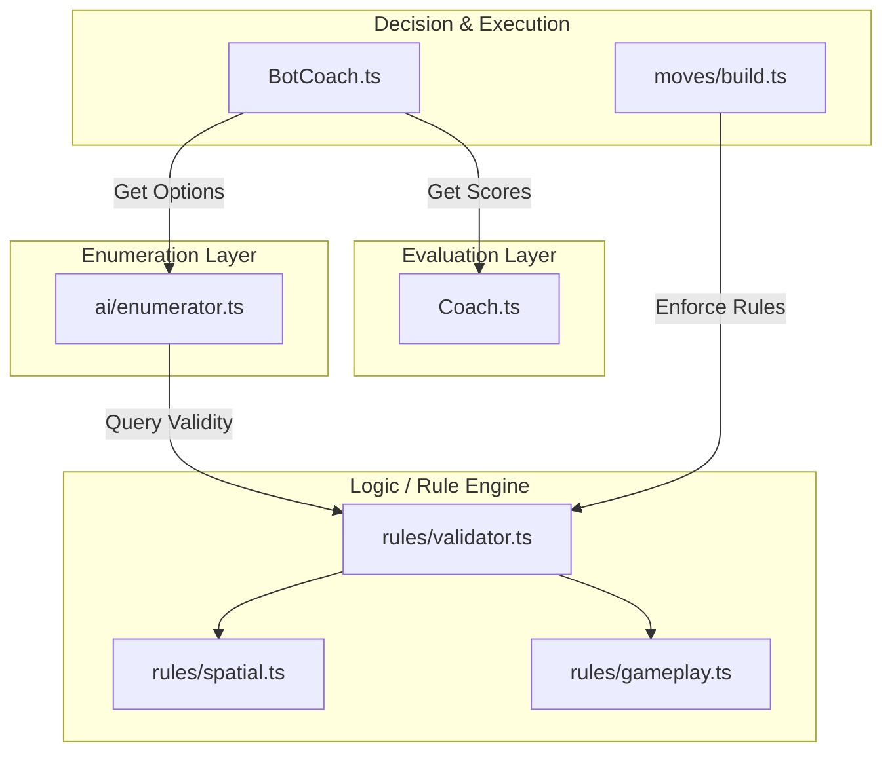

# Development Guide

This guide covers the technical architecture, setup instructions, and contribution guidelines for **Hex-Mastery**.

## 🛠 Tech Stack

The project is built on a modern React stack, leveraging `boardgame.io` for state management and networking.

*   **Frontend**: React + TypeScript + Vite
*   **Game Engine**: [boardgame.io](https://boardgame.io/) (State Management, Move Validation, Multiplayer Networking)
*   **Visualization**: `react-hexgrid` (SVG-based board rendering)
*   **Styling**: Tailwind CSS
*   **Testing**: Jest (Unit), Playwright (E2E)

## 🚀 Getting Started

### Prerequisites

*   Node.js (v18+)
*   npm

### Installation

1.  **Clone the repository:**
    ```bash
    git clone https://github.com/your-username/hex-mastery.git
    cd hex-mastery
    ```

2.  **Install dependencies:**
    ```bash
    npm install
    # OR run the setup script which also installs Playwright browsers
    ./scripts/setup.sh
    ```

3.  **Run the development server:**
    ```bash
    npm run dev
    ```
    Open `http://localhost:5173` to view the app.

## 🧪 Testing

We use a dual-layer testing strategy:

*   **Unit Tests (Jest)**: Focus on game logic (moves, scoring, geometry).
    ```bash
    npm test
    ```
*   **E2E Tests (Playwright)**: Focus on UI interactions, board rendering, and "Coach Mode" overlays.
    ```bash
    npm run test:e2e
    ```

## 🏗 Architecture

The project follows a 4-Layer Architecture to separate concerns between Rules, Enumeration, Evaluation, and Decision.

### 1. Logic Layer (The "Rule Engine")
*   **`src/game/rules/validator.ts`**: The Facade (Single Source of Truth). It exposes `RuleEngine.validateMove` and `RuleEngine.validateMoveOrThrow`.
*   **`src/game/rules/gameplay.ts`**: Validates state-aware moves (e.g., costs, turn order).
*   **`src/game/rules/spatial.ts`**: Validates pure geometric rules (e.g., "Is this spot connected?").
*   **`src/game/rules/common.ts`**: Shared utilities (Security, Affordability).

### 2. Enumeration Layer (The "Generator")
*   **`src/game/ai/enumerator.ts`**: Generates all legally possible actions for a turn.
    *   It iterates through `STAGE_MOVES` (constants).
    *   It uses `RuleEngine` to find valid arguments (e.g., "Which edges can I build a road on?").
    *   It powers the Bot's decision tree.

### 3. Evaluation Layer (The "Analyst")
*   **`src/game/analysis/coach.ts`**: The "Brain". It scores actions based on game theory:
    *   **Strategic Advice**: "Build Roads" vs "Build Cities" (High-level strategy).
    *   **Spatial Scoring**: Heatmaps for specific board spots (pips, scarcity).
    *   It exposes `scoreAction` and `getStrategicAdvice`.

### 4. Decision Layer (The "Bot")
*   **`src/bots/BotCoach.ts`**: The "Bridge". It selects the best move from the Enumerator layer by:
    *   Applying `BotProfile` weights (Personality).
    *   Boosting moves recommended by the `Coach` (Strategy).
    *   Refining top candidates using `Coach` heatmaps (Tactics).
*   **`src/game/moves/*.ts`**: The "Execution Layer". These files are dumb executors that mutate state after delegating validation to the `RuleEngine`.

### Architecture Diagram



### Architecture Verification

We enforce this 4-layer architecture using `dependency-cruiser`. This ensures that lower layers (like Mechanics or Rules) never accidentally import from higher layers (like AI or Moves), keeping the dependency graph clean and acyclic.

*   **Command Line**: You can verify the architecture manually by running:
    ```bash
    npm run check:arch
    ```
*   **Automated Check**: This check is automatically run as part of the build process (`npm run build`).
*   **VS Code Extension**: For real-time feedback, we recommend installing the [Dependency Cruiser extension](https://marketplace.visualstudio.com/items?itemName=sverweij.dependency-cruiser-extension) for VS Code.

## 📂 Project Structure

```
src/
├── bots/           # AI implementations (BotCoach, Profiles)
├── components/     # React UI components (Board, GameControls)
├── game/           # Core Game Logic
│   ├── ai/         # Move Enumeration
│   ├── analysis/   # Coach & Scoring Heuristics
│   ├── mechanics/  # Mechanics (Resources, Costs)
│   ├── moves/      # Execution Layer (boardgame.io Moves)
│   ├── rules/      # Rule Engine (Validator, Spatial, Gameplay)
│   ├── config.ts   # Global constants (Board size, Costs)
│   └── Game.ts     # Main boardgame.io Game Object
├── styles/         # CSS & Tailwind config
└── App.tsx         # Main entry point
```

## 🗺️ Development Roadmap

### Completed Phases ✅
*   **Phase 1-4**: Core Engine & Heuristics.
*   **Phase 5 (Refactor)**: Unified 4-Layer Architecture (Validator, Enumerator).

### Current Focus: Phase 6 (UI/UX) 🚧
*   Refining Mobile Layouts (Drawer/Sidebar logic).
*   Polishing visual feedback (Tooltips, Toasts).

### Upcoming: Phase 7 (Full Loop) 🔮
*   Trade Phase implementation.
*   Robber mechanics.
*   Victory Point tracking & Win Conditions.

## 🤝 Contributing

1.  Create a feature branch (`git checkout -b feature/amazing-feature`).
2.  Ensure all tests pass (`npm test` & `npm run test:e2e`).
3.  Commit your changes.
4.  Open a Pull Request.

---
*For high-level strategy and game theory documentation, see [STRATEGY_ENGINE.md](./STRATEGY_ENGINE.md).*
