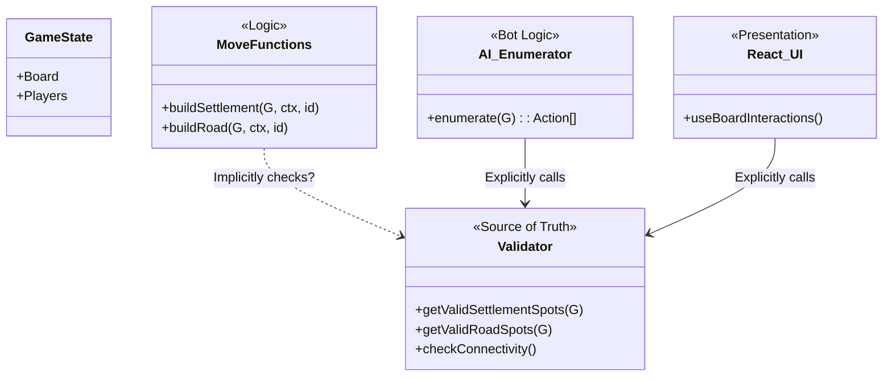
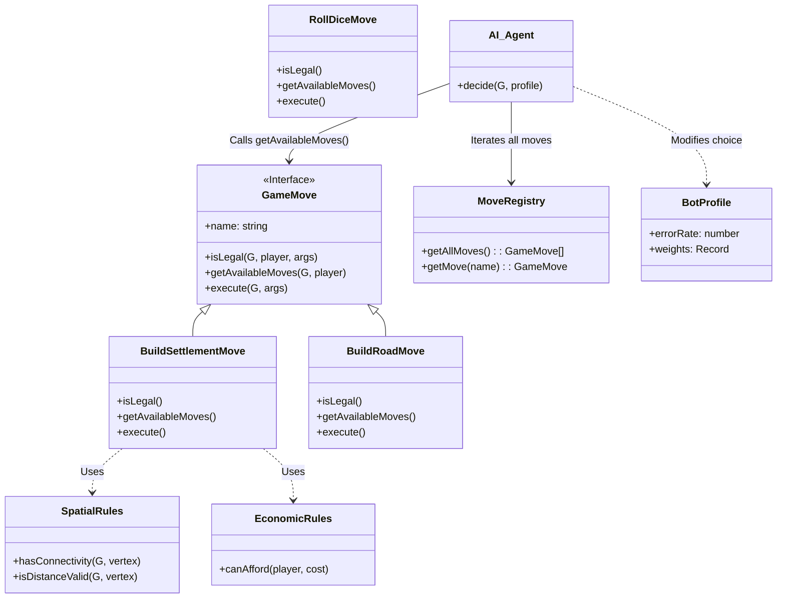

# Refactoring Plan: Unified Move Architecture

## 1. Executive Summary

This document outlines a plan to refactor the Hex-Mastery codebase to address architectural fragmentation. Currently, adding or modifying a game move requires changes across disjointed layers:
*   **Execution**: `src/game/moves/*.ts`
*   **Validation**: `src/game/rules/validator.ts`
*   **AI Enumeration**: `src/game/ai.ts`
*   **UI Interaction**: `src/hooks/useBoardInteractions.ts`

**Goal:** Unify these responsibilities into a single, cohesive **Move Definition** pattern. This ensures that the rules for *User* play and *AI* play are identical, validation is modular, and bots can easily simulate "imperfect" play.

---

## 2. Current Architecture Analysis

Currently, logic is split by *function* (UI vs. Logic vs. AI) rather than by *domain* (Settlements vs. Roads).

### Current Diagram



**Pain Points:**
1.  **Duplication**: `enumerate` in `ai.ts` manually reconstructs move objects that `moves/*.ts` essentially already knows about.
2.  **Inconsistency**: A move might be "valid" in the UI (via `validator.ts`) but fail in the move function if a check was missed or implemented differently.
3.  **Rigidity**: `validator.ts` is a monolith. Adding a new mechanic (e.g., "Ships") requires editing the giant validator file.

---

## 3. Proposed Architecture (The "Dream")

We will employ the **Command / Strategy Pattern**. Every game action (Build Settlement, Trade, Roll Dice) will be encapsulated in a Class or Object Definition that handles *all* aspects of that move.

### Design Pattern: The `GameMove` Interface

Every move in the game will implement this interface:

```typescript
interface GameMove<Args = any> {
    // 1. Identification
    name: string;

    // 2. Validation (Centralized)
    // Returns detailed success/failure for UI feedback
    isLegal(G: GameState, ctx: Ctx, playerID: string, args: Args): ValidationResult;

    // 3. Enumeration (For AI & UI Highlights)
    // Returns ALL possible valid arguments for the current state
    getAvailableMoves(G: GameState, ctx: Ctx, playerID: string): MoveOption<Args>[];

    // 4. Execution (The Logic)
    execute(G: GameState, ctx: Ctx, args: Args): void;

    // 5. Bot Scoring (Heuristic)
    // How good is this move? (Base score, can be modified by BotProfile)
    score(G: GameState, ctx: Ctx, args: Args): number;
}
```

### Validator Decomposition

Instead of one `validator.ts`, we will have granular **Rule Modules** that `GameMove` implementations compose.

*   **`src/game/rules/SpatialRules`**: Geometry, Distance, Connectivity.
*   **`src/game/rules/EconomicRules`**: Costs, Bank trading rates.
*   **`src/game/rules/StateRules`**: Turn order, Phases.

### New Class Hierarchy



### Handling Bot Profiles (Sub-optimal Play)

The `AI_Agent` will:
1.  Get all valid moves from `MoveRegistry`.
2.  Ask the move (or a centralized `Coach`) to `score()` them.
3.  **Apply Profile**:
    *   *Perfect Bot*: Picks the highest score.
    *   *Noisy Bot*: Adds random noise to the scores before sorting.
    *   *Biased Bot*: Multiplies scores based on move type (e.g., "Aggressive Bot" doubles `BuildRoad` score).

---

## 4. Phased Implementation Plan

We will treat this as a "Strangler Fig" migration—building the new system alongside the old one and gradually switching over.

### Phase 1: Foundation (The Interface)
*   **Task**: Define `GameMove` interface in `src/game/framework/types.ts`.
*   **Task**: Create `MoveRegistry` class.
*   **Goal**: Establish the contract without changing game logic.

### Phase 2: Vertical Slice (Proof of Concept)
*   **Task**: Migrate **ONE** complex move (e.g., `BuildSettlement`) to the new class structure.
    *   Create `src/game/moves/definitions/BuildSettlement.ts`.
    *   Extract logic from `validator.ts` into a local `SpatialRules` helper.
    *   Update the `buildSettlement` function in `moves.ts` to simply call `BuildSettlement.execute()`.
*   **Goal**: Prove that the wrapper works for `boardgame.io`.

### Phase 3: AI & UI Integration (The "Switch")
*   **Task**: Update `useBoardInteractions` to call `BuildSettlement.getAvailableMoves()` instead of `validator.getValidSettlementSpots()`.
*   **Task**: Update `ai.ts` to iterate `MoveRegistry` for the current stage.
*   **Goal**: AI and UI now share the exact same source of truth for "What can I do?".

### Phase 4: Validator Decomposition
*   **Task**: Break the rest of `validator.ts` into `SpatialRules`, `ResourceRules`, etc.
*   **Task**: Migrate remaining moves (`BuildRoad`, `BuildCity`, `RollDice`) to `GameMove` classes.
*   **Goal**: Empty out and remove the old `validator.ts` and hardcoded `ai.ts`.

### Phase 5: Advanced Bot Logic
*   **Task**: Refactor `BotCoach` to work as a filter over the standardized `GameMove` scores.
*   **Task**: Implement "Error Rates" in `BotProfile` to allow bots to pick 2nd/3rd best moves.

---

## 5. Directory Structure Changes

```
src/
  game/
    framework/         # NEW: Core abstractions
      GameMove.ts      # The Interface
      MoveRegistry.ts  # The Collection
    rules/             # Refactored Rules Engine
      Spatial.ts
      Economics.ts
      TurnOrder.ts
    moves/             # Converted to Classes
      definitions/
        BuildSettlement.ts
        BuildRoad.ts
```
