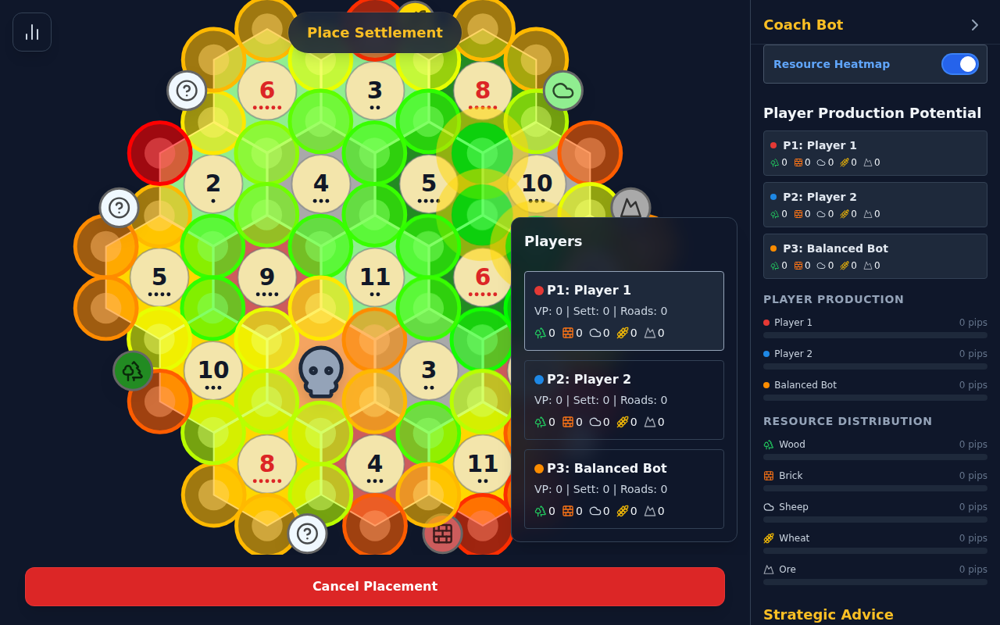

# The Strategy Engine: Game Theory & Heuristics

Hex-Mastery is not just a game; it is a **computational analysis tool** designed to decode the complex probability landscape of Catan. This document details the mathematical models, placement heuristics, and "Coach" logic used to evaluate board positions.

---

## 1. The Probabilistic Landscape

Catan is a game of managing a **Probability Density Function (PDF)**. The central engine—two six-sided dice (2d6)—creates a bell curve of outcomes that dictates the economic pulse of the game.

### 1.1 The 2d6 Bell Curve ("Pips")

There are 36 possible permutations when rolling two dice. We visualize these probabilities using "pips" (dots).

| Number | Combinations | Pips | Probability | Frequency |
| :---: | :--- | :---: | :---: | :---: |
| **2** | 1+1 | 1 | 2.78% | Low |
| **3** | 1+2, 2+1 | 2 | 5.56% | Low |
| **4** | 1+3, 3+1, 2+2 | 3 | 8.33% | Mod |
| **5** | 1+4, 4+1, 2+3, 3+2 | 4 | 11.11% | High |
| **6** | 1+5, 5+1, 2+4, 4+2, 3+3 | 5 | 13.89% | Peak |
| **7** | (Robber) | 6 | 16.67% | Robber |
| **8** | 2+6, 6+2, 3+5, 5+3, 4+4 | 5 | 13.89% | Peak |
| **9** | 3+6, 6+3, 4+5, 5+4 | 4 | 11.11% | High |
| **10** | 4+6, 6+4, 5+5 | 3 | 8.33% | Mod |
| **11** | 5+6, 6+5 | 2 | 5.56% | Low |
| **12** | 6+6 | 1 | 2.78% | Low |

### 1.2 "Pip" Strategy

The fundamental value of a settlement is the sum of the pips of its adjacent hexes.
*   **Maximum Value**: A settlement on 6-9-5 (5+4+4) = **13 Pips**.
*   **Minimum Viable**: A settlement on 2-3-12 (1+2+1) = **4 Pips**.

**Hex-Mastery Implementation**: The `Analyst` module calculates `G.pips` for every player in real-time, allowing you to see your "Production Potential" (Total Pips) vs. your actual production (Cards received).

---

## 2. The Geometry of Scarcity

The standard 19-hex board is designed to create resource bottlenecks. The distribution is fixed in the base game:

*   **Forest (Wood)**: 4 Hexes
*   **Pasture (Sheep)**: 4 Hexes
*   **Fields (Wheat)**: 4 Hexes
*   **Hills (Brick)**: 3 Hexes ⚠️
*   **Mountains (Ore)**: 3 Hexes ⚠️
*   **Desert**: 1 Hex

**Strategic Insight**: Brick and Ore are the natural bottlenecks.
*   **Brick**: Limits early expansion (Roads/Settlements).
*   **Ore**: Limits late-game consolidation (Cities/Dev Cards).

---

## 3. The "Coach" Algorithm

The `Coach` module (`src/game/analysis/coach.ts`) evaluates every possible intersection on the board and assigns a score based on three factors:

### 3.1 Base Score (Pips)
The raw production potential.
`Score = Sum(Pips)`

### 3.2 Scarcity Multiplier
The Coach analyzes the board layout. If a resource has low total pip availability board-wide (e.g., all Ore is on 2, 3, and 11), that resource becomes "Scarce."
*   **Scarcity Bonus**: Settlements providing scarce resources receive a **1.2x multiplier**.

### 3.3 Synergy & Diversity
*   **Resource Diversity**: Access to 3 unique resources is better than 3 hexes of the same type.
    *   *Bonus*: **1.2x multiplier** for high diversity.
*   **Combo Bonus**: Specific pairs (Brick + Wood) or (Ore + Wheat) enable critical actions (Road building / City building).
    *   *Bonus*: Flat score addition for securing a complete combo.

### 3.4 The Resource Heatmap
The resulting scores are normalized and projected onto the board as a "Heatmap Overlay."
*   **Gold Rings**: Indicate the Top 3 statistically best moves.
*   **Color Gradient**: Green (Good) to Red (Poor).

---

## 4. The Setup Phase: "Snake Draft"

The game is often won or lost in the setup. Hex-Mastery simulates the official tournament turn order:

`1 -> 2 -> 3 -> 4 -> 4 -> 3 -> 2 -> 1`

### Positional Strategy
*   **First Position (Player 1)**: Gets the best single spot on the board but waits the longest for their second pick. **Strategy**: Must prioritize the highest pip count or scarcest resource.
*   **Fourth Position (Player 4)**: The "Wheel." Places two settlements back-to-back. **Strategy**: Create instant synergy (e.g., secure a Monopoly on Ore) or block a large territory.

---

*For technical implementation details, see the [Development Guide](./DEVELOPMENT.md).*
