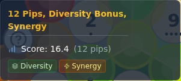

# Strategy Engine: Implementation Model & Heuristics

`docs/STRATEGY_ENGINE.md` is Hex-Mastery's **implementation-facing strategy model**. It details how domain theory, probability math, and placement heuristics are converted into executable software in the Coach and Analyst modules (`src/game/analysis/`).

---

## 🔄 Transformation Pipeline

Reference material tells us what exists in Catan. The implementation model describes what Hex-Mastery means by it and how those concepts become player-facing guidance:

$$\text{Catan Rules \& Reference Material} \longrightarrow \text{Engine Domain Representation} \longrightarrow \text{Rules + Strategy Model} \longrightarrow \text{Coach / Analyst Interpretation} \longrightarrow \text{UI Presentation}$$

1. **Catan Reference Material**: Standard board configuration, 2d6 probability curve, and official rules (`docs/Catan Strategy and Starting Rules.pdf`).
2. **Engine Domain Representation**: Board state, hex grid, vertex locations, and resource/pip distributions (`src/game/core/`, `src/game/geometry/`).
3. **Rules + Strategy Model**: Legal move enumeration (`enumerator.ts`) paired with Hex-Mastery evaluation heuristics (`coach.ts`, `analyst.ts`).
4. **Coach / Analyst Interpretation**: Normalization of raw heuristic scores into heatmap weights, rank tiers, and strategic advice strings.
5. **UI Presentation**: Heatmap overlays, gold ring badges, production bars, and tooltip summaries (`src/features/coach/`, `src/features/hud/`).

---

## 1. The Probabilistic Landscape

Catan is a game of managing a **Probability Density Function (PDF)**. Two six-sided dice (2d6) generate a bell curve of outcomes across 36 permutations.

### 1.1 The 2d6 Bell Curve ("Pips")

| Number | Combinations | Pips | Probability | Frequency |
| :---: | :--- | :---: | :---: | :---: |
| **2** | 1+1 | 1 | 2.78% | Low |
| **3** | 1+2, 2+1 | 2 | 5.56% | Low |
| **4** | 1+3, 3+1, 2+2 | 3 | 8.33% | Mod |
| **5** | 1+4, 4+1, 2+3, 3+2 | 4 | 11.11% | High |
| **6** | 1+5, 5+1, 2+4, 4+2, 3+3 | 5 | 13.89% | Peak |
| **7** | (Robber) | 6 | 16.67% | Robber |
| **8** | 2+6, 6+2, 3+5, 5+3, 4+4 | 5 | 13.89% | Peak |
| **9** | 3+6, 6+3, 4+5, 5+4 | 4 | 11.11% | High |
| **10** | 4+6, 6+4, 5+5 | 3 | 8.33% | Mod |
| **11** | 5+6, 6+5 | 2 | 5.56% | Low |
| **12** | 6+6 | 1 | 2.78% | Low |

### 1.2 "Pip" Implementation & Board Constraints

The fundamental value of a settlement spot is the sum of the pips of its adjacent hexes.
*   **Maximum Viable Spot Value**: **13 Pips** (e.g., a 6-9-5 or 8-9-5 intersection, 5+4+4 pips).
    *   *Board Invariant*: The board generator (`src/game/generation/boardGen.ts`) strictly enforces `isValidBoard`, rejecting any board layout where a 6 is adjacent to another 6 or 8. Therefore, no settlement vertex can be adjacent to both a 6 and an 8.
*   **Engine Tracking**: The `Analyst` module (`src/game/analysis/analyst.ts`) provides `calculatePlayerPotentialPips(G)`, which derives a per-player, per-resource pip potential map from placed settlements and cities. The UI renders these derived pips to show production capacity.

---

## 2. Geometry of Scarcity & Bottlenecks

The standard 19-hex board contains a fixed resource distribution:

*   **Forest (Wood)**: 4 Hexes
*   **Pasture (Sheep)**: 4 Hexes
*   **Fields (Wheat)**: 4 Hexes
*   **Hills (Brick)**: 3 Hexes ⚠️
*   **Mountains (Ore)**: 3 Hexes ⚠️
*   **Desert**: 1 Hex

**Strategic Insight**: Brick and Ore are natural bottlenecks.
*   **Brick**: Critical for early expansion (Roads & Settlements).
*   **Ore**: Critical for mid-to-late game consolidation (Cities & Development Cards).

---

## 3. The "Coach" Scoring Model

The `Coach` module (`src/game/analysis/coach.ts`) evaluates valid settlement vertices using a multi-factor scoring function:

### 3.1 Base Production Score
Sum of adjacent pips for the candidate vertex:
$$\text{Base Score} = \sum \text{Pips}_{\text{adjacent}}$$

### 3.2 Scarcity Multiplier
The Coach measures board-wide pip totals for each resource type. If a resource has low overall board availability (e.g., total board Ore pips < threshold), that resource is classified as scarce.
*   **Scarcity Adjustment**: Spots yielding scarce resources receive a scarcity weighting bonus (1.2x multiplier).

### 3.3 Synergy & Resource Diversity
*   **Resource Diversity**: Securing 3 distinct resource types is weighted higher than 3 duplicate hexes.
*   **Expansion Synergy**: Complementary pairs (Brick + Wood for Roads; Ore + Wheat for Cities) grant additional synergy bonuses.

### 3.4 Heatmap & Color Mapping
Candidate spot scores are normalized relative to `minScore` and `maxScore`:
*   **Gold Rings (Top Moves)**: Highlight the top 3 statistically scored settlement locations.
*   **Heatmap Color Mapping**: Handled by `getHeatmapColor(score, min, max)`, which maps the minimum score to hue 0 (red) and the maximum score to hue 120 (green) via HSL string interpolation.

---

## 4. Setup Draft ("Snake Draft") Logic

Hex-Mastery implements the standard tournament snake draft sequence for initial settlement placement:

$$1 \longrightarrow 2 \longrightarrow 3 \longrightarrow 3 \longrightarrow 2 \longrightarrow 1 \quad \text{(for 3-player games)}$$

*   **Position 1**: First choice on highest raw pip spot, but longest delay before second settlement.
*   **Position 3 ("The Wheel")**: Back-to-back placement allowance enabling immediate production combo synergy.

---
*For architectural layer boundaries, see [ARCHITECTURE.md](./ARCHITECTURE.md).*
